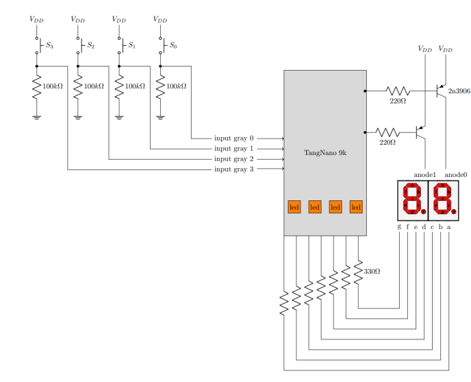

# Circuito decodificador de Gray

## 1. Abreviaturas y definiciones
- **FPGA**: Field Programmable Gate Arrays

## 2. Resumen
En el presente documento, se explica la implementación de un diseño digital en una FPGA, con el cual, se pretende elaborar un decodificador de código Gray. Se utilizan 3 subsistemas: un subsistema de lectura y decodificación de código Gray, un subsistema de despliegue de código ingresado traducido a formato binario en luces LED y un último subsistema que despliega el código decodificado en display de 7 segmentos.

## 3. Introducción
El presente documento, tiene como objetivo mostrar la elaboración de un decodificador de código Gray, implementando un diseño digital en una FPGA. Para lograr lo anterior, se elaboró un subsistema de lectura y decodificación de código Gray, el cual, traduce dicho código a código binario, antes de ser enviado a los otros subsistemas. Además, se hicieron otros dos subsistemas, que muestran el código decodificado en luces Led y display de 7 segmentos, respectivamente.

También, para cada subsistema se elaboraron Testbench, para verificar el adecuado funcionamiento de cada módulo, antes de ser implementado en la FPGA. Finalmente se realizó la implementación en la FPGA, utilizando una protoboard, para lo cual, se usó como referencia el circuito mostrado en la siguiente imagen. 




Sin embargo, no se utilizaron los transistores PNP 2N3906, debido a que el subsistema de despliegue del código decodificado en los 7-segmentos, no lo requiere. 

## 3. Desarrollo

### 3.0 Descripción general del sistema

El sistema que se requiere elaborar es un decodificador de código Gray, para lo cual, se plantea la realización de tres subsistemas: un subsistema de lectura y decodificación de código Gray y dos subsistemas que despliegan el código decodificado, en leds y display de 7 segmentos, respectivamente.
#### 1. Testbench

### 3.1 Subsistema de lectura y decodificación de código Gray
#### 1. Encabezado del módulo
```SystemVerilog
module decoder (
    input logic ag, bg, cg, dg, 
    output logic ab, bb, cb, db);
```
#### 2. Entradas y salidas:
- `ag, bg, cg, dg`: bits de entrada en código Gray
- `ab, bb, cb, db`: bits de salida en código binario

#### 3. Criterios de diseño
Diagramas, texto explicativo...

#### 4. Testbench
Descripción y resultados de las pruebas hechas

### 3.2  Subsistema de despliegue de código ingresado traducido a formato binario
en luces LED
#### 1. Encabezado del módulo
```SystemVerilog
module module_leds (
    input logic [3:0] binario,
    output reg[3:0] led
    );
```

#### 2. Entradas y salidas:
- `binario`: entrada de 4 bits, que proviene del subsistema de lectura y decodificación de código Gray.
- `led`: salida de 4 bits, que se encarga de manejar los leds en la FPGA.

#### 3. Criterios de diseño
Diagramas, texto explicativo...

#### 4. Testbench
Descripción y resultados de las pruebas hechas

### 3.3  Subsistema de despliegue de código decodificado en display de 7 segmentos.
#### 1. Encabezado del módulo
```SystemVerilog
module module_seg (
    input logic clk,
    input logic A, B, C, D,
    output logic au, bu, cu, du, eu, fu, gu,0
    output logic ad, bd, cd, dd, ed, fd, gd 
    );
```

#### 2. Entradas y salidas:
- `clk`: reloj que actualiza en los 7 segmentos los valores binarios recibidos.
- `A, B, C, D,`: variables de entrada, que provienen del subsistema de lectura y decodificación de código Gray.
-  `au, bu, cu, du, eu, fu, gu,0`: variables de salida que controlan los pines de la FPGA, que se conectan a cada uno de los segmentos, del 7 segmentos que representa las unidades.
 -  `au, bu, cu, du, eu, fu, gu,0`: variables de salida que controlan los pines de la FPGA, que se conectan a cada uno de los segmentos, del 7 segmentos que representa las decenas.


#### 3. Criterios de diseño
Diagramas, texto explicativo...

#### 4. Testbench
Descripción y resultados de las pruebas hechas


## 4. Consumo de recursos

## 5. Problemas encontrados durante el proyecto

## 6. Referencias
[0] David Harris y Sarah Harris. *Digital Design and Computer Architecture. RISC-V Edition.* Morgan Kaufmann, 2022. ISBN: 978-0-12-820064-3
