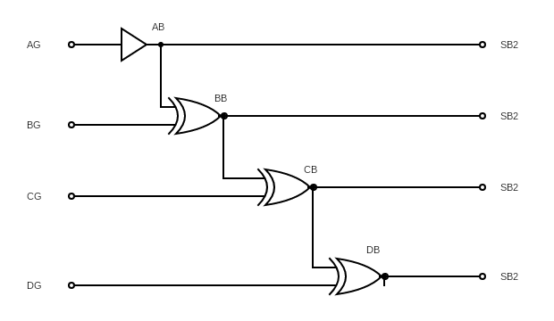
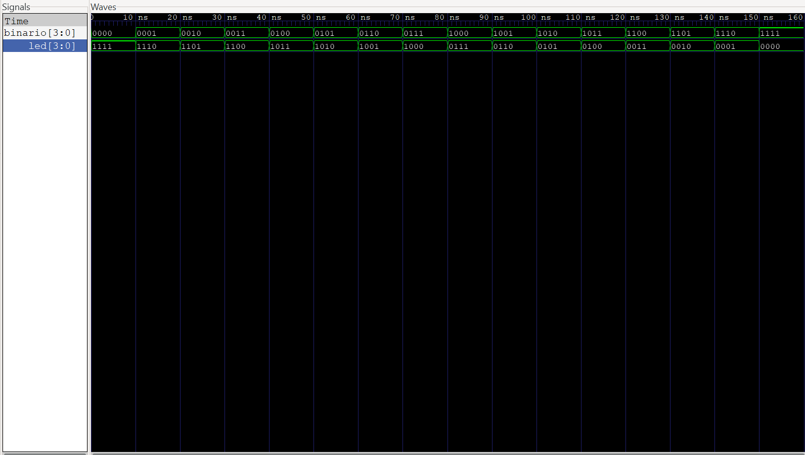

# Circuito decodificador de Gray

## 1. Abreviaturas y definiciones
- **FPGA**: Field Programmable Gate Arrays
- **xb/XB**: bit x en código binario
- **xg/AG**: bit x en código gray
- **SB1**: Subsistema 1
- **SB2**: Subsistema 2


## 2. Resumen
En el presente documento, se explica la implementación de un diseño digital en una FPGA, con el cual, se pretende elaborar un decodificador de código Gray. Se utilizan 3 subsistemas: un subsistema de lectura y decodificación de código Gray, un subsistema de despliegue de código ingresado traducido a formato binario en luces LED y un último subsistema que despliega el código decodificado en display de 7 segmentos.

## 3. Introducción
El presente documento, tiene como objetivo mostrar la elaboración de un decodificador de código Gray, implementando un diseño digital en una FPGA. Para lograr lo anterior, se elaboró un subsistema de lectura y decodificación de código Gray, el cual, traduce dicho código a código binario, antes de ser enviado a los otros subsistemas. Además, se hicieron otros dos subsistemas, que muestran el código decodificado en luces Led y display de 7 segmentos, respectivamente.

También, para cada subsistema se elaboraron Testbench, para verificar el adecuado funcionamiento de cada módulo, antes de ser implementado en la FPGA. Finalmente se realizó la implementación en la FPGA, utilizando una protoboard, para lo cual, se usó como referencia el circuito mostrado en la siguiente imagen. 


Sin embargo, no se utilizaron los transistores PNP 2N3906, debido a que el subsistema de despliegue del código decodificado en los 7-segmentos, no lo requiere. 

## 3. Desarrollo

### 3.0 Descripción general del sistema

El sistema que se requiere elaborar es un decodificador de código Gray, para lo cual, se plantea la realización de tres subsistemas: un subsistema de lectura y decodificación de código Gray y dos subsistemas que despliegan el código decodificado, en leds y display de 7 segmentos, respectivamente.
#### 1. Testbench
Para verificar el adecuado funcionamiento de los 3 subsistemas en conjunto, se realizó un Testbench. Primero se defnieron las señales de entrada, que se van a generar para probar el módulo, así como las señales de salida:
```SystemVerilog
    logic clk;
    logic ag, bg, cg, dg;
    logic [3:0] led;
    logic au, bu, cu, du, eu, fu, gu;
    logic ad, bd, cd, dd, ed, fd, gd;
```
Posteriormente, se realiza la instanciación del módulo, mediante el cual, se van a conectar las entradas y salidas del módulo con las señales del testbench:
```SystemVerilog
     top_module_2 uut (
        .clk(clk),
        .ag(ag),
        .bg(bg),
        .cg(cg),
        .dg(dg),
        .led(led),
        .au(au),
        .bu(bu),
        .cu(cu),
        .du(du),
        .eu(eu),
        .fu(fu),
        .gu(gu),
        .ad(ad),
        .bd(bd),
        .cd(cd),
        .dd(dd),
        .ed(ed),
        .fd(fd),
        .gd(gd)
    );
```
Luego, se define el funcionamiento del reloj, con 10 unidades de tiempo para cada período y un retraso de 5 unidades de tiempo entre el flanco positivo y el negativo del reloj:
```SystemVerilog
     always begin

        clk = 1; 
        #5;
        clk = 0;
        #5;

    end
```
Luego, se establecen los casos de entrada que se van a tener, estos casos simulan el código Gray que se va a ingresar en el subsistema, además se establece que, para hacer un cambio en las señales se espere un tiempo de 10 nanosegundos:
```SystemVerilog
     
  initial begin
        ag = 0;
        bg = 0;
        cg = 0;
        dg = 0;
        #10;
        
        ag = 1; bg = 0; cg = 0; dg = 0;
        #10;
        ag = 0; bg = 1; cg = 0; dg = 0;
        #10;
        ag = 0; bg = 0; cg = 1; dg = 0;
        #10;
        ag = 0; bg = 0; cg = 0; dg = 1;
        #10;
        
        ag = 1; bg = 1; cg = 0; dg = 0;
        #10;
        ag = 1; bg = 1; cg = 1; dg = 0;
        #10;
        ag = 1; bg = 1; cg = 1; dg = 1;
        #10;
        ag = 0; bg = 0; cg = 0; dg = 0; 
        #10;

        $finish;
    end
```
Se imprimen los valores de las señales de salida, esto para verificar el adecuado funcionamiento de los módulos durante la simulación:
```SystemVerilog
     initial begin
        $monitor("Time = %0t | led = %b | au = %b, bu = %b, cu = %b, du = %b, eu = %b, fu = %b, gu = %b",
        $time, led, au, bu, cu, du, eu, fu, gu);
    end
```
El resultado que se obtuvo, es el mostrado en la siguiente imagen. Donde se aprecia el correcto funcionamiento de los 3 módulos en conjunto, mostrando el valor de salida que se tiene del decodificador ante una cierta entrada, y el estado de los leds y 7 segmentos ante la salida del decodificador:


### 3.1 Subsistema de lectura y decodificación de código Gray
#### 1. Encabezado del módulo
```SystemVerilog
module decoder (
    input logic ag, bg, cg, dg, 
    output logic ab, bb, cb, db);
```
#### 2. Entradas y salidas:
- `ag, bg, cg, dg`: bits de entrada en código Gray
- `ab, bb, cb, db`: bits de salida en código binario

#### 3. Criterios de diseño
El presente subsistema recibe un código Gray de 4 bits, el cual, se decodifica a código binario, para ser enviado a los otros subsistemas. A continuación se muestra el diagrama de bloques del subsistema:




Una vez que se definen las entradas y salidas, se utiliza lógica booleana para realizar la decodificación. Para el bit más significativo de código binario, se le asigna el valor igual al bit más significativo del código Gray, ya que, el bit más significativo del código binario siempre es igual al bit más significativo del código Gray:
```SystemVerilog
assign ab = ag;
```
Para obtener la salida bb, se utiliza la operación booleana XOR, entre las entradas ab y bg, esto ya que, para obtener cada bit en binario, se puede utilizar la operación booleana XOR, del bit actual Gray con el bit anterior del código Gray. Lo mismo se hace para generar los demás bits del código binario:
```SystemVerilog
    assign bb = (ag ^ bg);
    assign cb = ((ag ^ bg) ^ cg);
    assign db = (((ag ^ bg) ^ cg) ^ dg);
```
#### 4. Testbench
Para verificar el adecuado funcionamiento del módulo, se realizó un testbench. Primero se defnieron las señales de entrada, que se van a generar para probar el módulo, así como las señales de salida:
```SystemVerilog
     // Inputs
    reg ag;
    reg bg;
    reg cg;
    reg dg;

    // Outputs
    wire ab;
    wire bb;
    wire cb;
    wire db;
```
Posteriormente, se realiza la instanciación del módulo, mediante el cual, se van a conectar las entradas y salidas del módulo decoder con las señales del testbench:
```SystemVerilog
     decoder dut (
        .ag(ag),
        .bg(bg),
        .cg(cg),
        .dg(dg),
        .ab(ab),
        .bb(bb),
        .cb(cb),
        .db(db)
    );
```
Luego, se establecen los casos de entrada que se van a tener, estos casos simulan el código Gray que se va a ingresar en el subsistema, además se establece que, para hacer un cambio en las señales se espere un tiempo de 10 nanosegundos:
```SystemVerilog
     
   initial begin
       
        ag = 0; bg = 0; cg = 0; dg = 0;
        #10; ag = 0; bg = 0; cg = 0; dg = 0; 
        #10; ag = 1; bg = 0; cg = 0; dg = 0; 
        #10; ag = 0; bg = 1; cg = 0; dg = 0;
        #10; ag = 1; bg = 1; cg = 0; dg = 0;
        #10; ag = 0; bg = 0; cg = 1; dg = 0; 
        #10; ag = 1; bg = 0; cg = 1; dg = 0; 
        #10; ag = 0; bg = 1; cg = 1; dg = 0; 
        #10; ag = 1; bg = 1; cg = 1; dg = 0; 
        #10; ag = 0; bg = 0; cg = 0; dg = 1; 
        #10; ag = 1; bg = 0; cg = 0; dg = 1; 
        #10; ag = 0; bg = 1; cg = 0; dg = 1;
        #10; ag = 1; bg = 1; cg = 0; dg = 1; 
        #10; ag = 0; bg = 0; cg = 1; dg = 1; 
        #10; ag = 1; bg = 0; cg = 1; dg = 1;
        #10; ag = 0; bg = 1; cg = 1; dg = 1; 
        #10; ag = 1; bg = 1; cg = 1; dg = 1; 
        
        $finish;
    end
```
Finalmente, se definen los archivos que van a contener la información de las simulaciones:
```SystemVerilog
     initial begin
    $dumpfile("decoder_tb.vcd");
    $dumpvars(0,decoder_tb);
    end
```
Análisis de resultado:
El resultado del test bench de este subsistema se puede obervar en el siguiente diagrama de tiempos:


Para poder entender estos resultados, se debe saber el algoritmo de conversión de código gray a código binario:
1. Mantener el bit más significativo
2. Aplicar la suma binaria entre el bit anterior y el que se pretende pasar a código binario (si hay acarreo, el resultado es 0), lo cuál corresponde a la operación binaria XOR

Tomando este algorimo como base, se pueden interpretar los resultados obtenidos del diagrama de tiempos obtenidos:  se observa que el bit más significativo en código binario (ab) siempre es el mismo que el bit más significativo en código gray (ag) para todas las pruebas realizadas, lo cuál es esperado y coherente con el algortimo de conversión descrito. Para los demás bits en código gray (bg, cg,  dg), se observa que su respectiva salida en binario (bb,cg, dg) es el XOR de el mismo con el bit anterior, lo cuál tambien coincide con el algoritmo descrito, Por lo tanto, estos resultados demuestran que este subsistema cumple con el propósito de decodificar de código gray a binario.

### 3.2  Subsistema de despliegue de código ingresado traducido a formato binario en luces LED
#### 1. Encabezado del módulo
```SystemVerilog
module module_leds (
    input logic [3:0] binario,
    output reg[3:0] led
    );
```

#### 2. Entradas y salidas:
- `binario`: entrada de 4 bits, que proviene del subsistema de lectura y decodificación de código Gray.
- `led`: salida de 4 bits, que se encarga de manejar los leds en la FPGA.

#### 3. Criterios de diseño
El presente módulo recibe el código binario del módulo decoder y lo despliega en 4 leds que se encuentran en la FPGA. A continuación se muestra el diagrama de bloques del subsistema:


Para lograr lo anterior, se le asigna a cada led, la condición de que se encienda si la señal de entrada binario coincide con los valores establecidos, en los cuales se requiere que el led esté encendido, para mostrar adecuadamente el valor binario. Además, la entrada binario debe negarse, ya que, en el módulo decoder la salida no se negó, lo anterior es necesario, para mostrar adecuadamente el código binario en los leds.
```SystemVerilog
 assign led[0] = ~((binario == 4'b0001)| (binario == 4'b0011)| (binario == 4'b0101) | (binario == 4'b0111) | (binario == 4'b1001)| (binario == 4'b1011) | (binario == 4'b1101) | (binario == 4'b1111)) ; 

    assign led[1] = ~((binario == 4'b0010) | (binario == 4'b0011) | (binario == 4'b0110) | (binario == 4'b0111) | (binario == 4'b1010) | (binario == 4'b1011) | (binario == 4'b1110) | (binario == 4'b1111)) ;

    assign led[2] = ~((binario== 4'b0100)| (binario == 4'b0101) | (binario == 4'b0111) | (binario == 4'b0110)| (binario == 4'b1100)| (binario == 4'b1101) | (binario == 4'b1111) | (binario == 4'b1110)) ;

    assign led[3] = ~((binario== 4'b1000)| (binario == 4'b1101) | (binario == 4'b1001) | (binario == 4'b1010)| (binario == 4'b1011)| (binario == 4'b1100) | (binario == 4'b1101) | (binario == 4'b1110) | (binario == 4'b1111));
 
```
#### 4. Testbench
Para verificar el adecuado funcionamiento del módulo, se realizó un testbench. Primero se defnieron las señales de entrada, que se van a generar para probar el módulo, así como las señales de salida. Se tiene una entrada de 4 bits y la salida que se despliega a los leds de 4 bits también:
```SystemVerilog
    logic [3:0] binario;
    logic [3:0] led;
```
Posteriormente, se realiza la instanciación del módulo, mediante el cual, se van a conectar las entradas y salidas del módulo leds con las señales del testbench:
```SystemVerilog
     module_leds uut (
        .binario(binario),
        .led(led)
    );
```
Luego, se establecen los casos de entrada que se van a tener, estos casos simulan las señales de salida del módulo decoder, el cual, decodifica el código Gray a binario. Además se establece que, para hacer un cambio en las señales se espere un tiempo de 10 nanosegundos y se muestre el estado de los leds:
```SystemVerilog
     
   initial begin

        binario = 4'b0000;
        #10;
        $display(led[3], led[2], led[1], led[0]);
        binario = 4'b0001;
        #10;  
        $display(led[3], led[2], led[1], led[0]);
        binario = 4'b0010;
        #10;  
        $display(led[3], led[2], led[1], led[0]);
        binario = 4'b0011;
        #10;  
        $display(led[3], led[2], led[1], led[0]);
        binario = 4'b0100;
        #10;  
        $display(led[3], led[2], led[1], led[0]);
        binario = 4'b0101;
        #10;  
        $display(led[3], led[2], led[1], led[0]);
        binario = 4'b0110;
        #10;  
        $display(led[3], led[2], led[1], led[0]);
        binario = 4'b0111;
        #10;  
        $display(led[3], led[2], led[1], led[0]);
        binario = 4'b1000;
        #10;  
        $display(led[3], led[2], led[1], led[0]);
        binario = 4'b1001;
        #10;  
        $display(led[3], led[2], led[1], led[0]);
        binario = 4'b1010;
        #10;  
        $display(led[3], led[2], led[1], led[0]);
        binario = 4'b1011;
        #10;  
        $display(led[3], led[2], led[1], led[0]);
        binario = 4'b1100;
        #10;  
        $display(led[3], led[2], led[1], led[0]);
        binario = 4'b1101;
        #10;  
        $display(led[3], led[2], led[1], led[0]);
        binario = 4'b1110;
        #10;  
        $display(led[3], led[2], led[1], led[0]);
        binario = 4'b1111;
        #10;  
        $display(led[3], led[2], led[1], led[0]);

        $finish;
    end
```
Finalmente, se definen los archivos que van a contener la información de las simulaciones:
```SystemVerilog
    initial begin
        $dumpfile("module_leds_tb.vcd");
        $dumpvars(0, module_leds_tb);
    end
```
Análisis de resultado:
Como se explicó en los criterios de diseño de este susbsitema, se debe negar la entrada recibida por el subsistema 1 para obtener una correcta representación del código binario decodificado en los LEDs, lo anterior se puede observar en el siguiente diagrama de tiempos del subsistema:




donde se observa lo anteriormente explicado, y se asegura la correcta representación del código binario.
### 3.3  Subsistema de despliegue de código decodificado en display de 7 segmentos.
#### 1. Encabezado del módulo
```SystemVerilog
module module_seg (
    input logic clk,
    input logic A, B, C, D,
    output logic au, bu, cu, du, eu, fu, gu,0
    output logic ad, bd, cd, dd, ed, fd, gd 
    );
```

#### 2. Entradas y salidas:
- `clk`: reloj que actualiza en los 7 segmentos los valores binarios recibidos.
- `A, B, C, D,`: variables de entrada, que provienen del subsistema de lectura y decodificación de código Gray.
-  `au, bu, cu, du, eu, fu, gu,0`: variables de salida que controlan los pines de la FPGA, que se conectan a cada uno de los segmentos, del 7 segmentos que representa las unidades.
 -  `au, bu, cu, du, eu, fu, gu,0`: variables de salida que controlan los pines de la FPGA, que se conectan a cada uno de los segmentos, del 7 segmentos que representa las decenas.


#### 3. Criterios de diseño
El presente subsistema recibe el código binario, generado por el módulo decoder, que pasa el código Gray a binario, y lo despliega en 2 7 segmentos, controlando los pines de la FPGA que se conectan a ellos. A continuación se muestra el diagrama de bloques del subsistema:

Primero, se establece mediante lógica secuencial, que el contenido del bloque va a funcionar en cada flanco positivo del reloj clk. Luego, se asignan los valores que va a tener cada segmento del 7 segmentos de las unidades y los valores que van a tener cada segmento del 7 segementos de las decenas. 
```SystemVerilog
// Asignacion del 7 segmentos de unidades
        au <= ~((~A & ~B & ~C & ~D) | (~A & ~B & C & ~D) | (~A & ~B & C & D) | (~A & B & ~C & D) | (~A & B & C & ~D) | (~A & B & C & D) | (A & ~B & ~C & ~D) | (A & ~B & ~C & D) | (A & ~B & C & ~D) | (A & B & ~C & ~D) | (A & B & ~C & D) | (A & B & C & D));
        bu <= ~((~A & ~B & ~C & ~D) | (~A & ~B & ~C & D) | (~A & ~B & C & ~D) | (~A & ~B & C & D) | (~A & B & ~C & ~D) | (~A & B & C & D) | (A & ~B & ~C & ~D) | (A & ~B & ~C & D) | (A & ~B & C & ~D) | (A & ~B & C & D) | (A & B & ~C & ~D) | (A & B & ~C & D) | (A & B & C & ~D));
        cu <= ~((~A & ~B & ~C & ~D) | (~A & ~B & ~C & D) | (~A & ~B & C & D) | (~A & B & ~C & ~D) | (~A & B & ~C & D) | (~A & B & C & ~D) | (~A & B & C & D) | (A & ~B & ~C & ~D) | (A & ~B & ~C & D) | (A & ~B & C & ~D) | (A & ~B & C & D) | (A & B & ~C & D) | (A & B & C & ~D) | (A & B & C & D));
        du <= ~((~A & ~B & ~C & ~D) | (~A & ~B & C & ~D) | (~A & ~B & C & D) | (~A & B & ~C & D) | (~A & B & C & ~D) | (A & ~B & ~C & ~D) | (A & ~B & ~C & D) | (A & ~B & C & ~D) | (A & B & ~C & ~D) | (A & B & ~C & D) | (A & B & C & D));
        eu <= ~((~A & ~B & ~C & ~D) | (~A & ~B & C & ~D) | (~A & B & C & ~D) | (A & ~B & ~C & ~D) | (A & ~B & C & ~D) | (A & B & ~C & ~D));
        fu <= ~((~A & ~B & ~C & ~D) | (~A & B & ~C & ~D) | (~A & B & ~C & D) | (~A & B & C & ~D) | (A & ~B & ~C & ~D) | (A & ~B & ~C & D) | (A & ~B & C & ~D) | (A & B & C & ~D) | (A & B & C & D));
        gu <= ~((~A & ~B & C & ~D) | (~A & ~B & C & D) | (~A & B & ~C & ~D) | (~A & B & ~C & D) | (~A & B & C & ~D) | (A & ~B & ~C & ~D) | (A & ~B & ~C & D) | (A & B & ~C & ~D) | (A & B & ~C & D) | (A & B & C & ~D) | (A & B & C & D));

        // Asignacion del 7 segmentos de decimas
        ad <= ~((~A & ~B & ~C & ~D) | (~A & ~B & ~C & D) | (~A & ~B & C & ~D) | (~A & ~B & C & D) | (~A & B & ~C & ~D) | (~A & B & ~C & D) | (~A & B & C & ~D) | (~A & B & C & D) | (A & ~B & ~C & ~D) | (A & ~B & ~C & D));
        bd <= 0; // El segmento b del 7 segmentos de decimas en este proyecto siempre esta apagado.
        cd <= 0; // El segmento c del 7 segmentos de decimas en este proyecto siempre esta apagado.
        dd <= ~((~A & ~B & ~C & ~D) | (~A & ~B & ~C & D) | (~A & ~B & C & ~D) | (~A & ~B & C & D) | (~A & B & ~C & ~D) | (~A & B & ~C & D) | (~A & B & C & ~D) | (~A & B & C & D) | (A & ~B & ~C & ~D) | (A & ~B & ~C & D));
        ed <= ~((~A & ~B & ~C & ~D) | (~A & ~B & ~C & D) | (~A & ~B & C & ~D) | (~A & ~B & C & D) | (~A & B & ~C & ~D) | (~A & B & ~C & D) | (~A & B & C & ~D) | (~A & B & C & D) | (A & ~B & ~C & ~D) | (A & ~B & ~C & D));
        fd <= ~((~A & ~B & ~C & ~D) | (~A & ~B & ~C & D) | (~A & ~B & C & ~D) | (~A & ~B & C & D) | (~A & B & ~C & ~D) | (~A & B & ~C & D) | (~A & B & C & ~D) | (~A & B & C & D) | (A & ~B & ~C & ~D) | (A & ~B & ~C & D));
        gd <= 1; // El segmento g del 7 segmentos de decimas en este proyecto siempre esta encendido.

    end 

```
Lo anterior, se logró mediante la simplificación de las ecuaciones booleanas obtenidas para cada segemento, mediante un mapa de Karnaugh. A continuación se muestra un ejemplo:


#### 4. Testbench
Para verificar el adecuado funcionamiento del módulo, se realizó un testbench. Primero se defnieron las señales de entrada, que se van a generar para probar el módulo, así como las señales de salida:
```SystemVerilog
    logic clk;
    logic A, B, C, D; //Input
    logic au, bu, cu, du, eu, fu, gu; //Output 7 segementos de las unidades
    logic ad, bd, cd, dd, ed, fd, gd;//Output 7 segementos de las decenas
```
Posteriormente, se realiza la instanciación del módulo, mediante el cual, se van a conectar las entradas y salidas del módulo seg con las señales del testbench:
```SystemVerilog
      module_seg uut (
        .clk(clk),
        .A(A),
        .B(B),
        .C(C),
        .D(D),
        .au(au),
        .bu(bu),
        .cu(cu),
        .du(du),
        .eu(eu),
        .fu(fu),
        .gu(gu),
        .ad(ad),
        .bd(bd),
        .cd(cd),
        .dd(dd),
        .ed(ed),
        .fd(fd),
        .gd(gd)
    );
```
Luego, se define el funcionamiento del reloj, con 10 unidades de tiempo para cada período y un retraso de 5 unidades de tiempo entre el flanco positivo y el negativo del reloj:
```SystemVerilog
     always begin

        clk = 1; 
        #5;
        clk = 0;
        #5;

    end
```

Luego, se establecen los casos de entrada que se van a tener, estos casos simulan las señales de salida del módulo decoder, el cual, decodifica el código Gray a código binario. Además se establece que, para hacer un cambio en las señales se espere un tiempo de 10 nanosegundos:
```SystemVerilog
     initial begin

        // Valores iniciales de la prueba.
        A = 0;
        B = 0;
        C = 0;
        D = 0;

        // Cambio en los valores de entrada iniciales, cada 10 unidades de tiempo.
        // Primer cambio 
        #10;
        A = 0;
        B = 1;
        C = 1;
        D = 0;

        // Segundo cambio
        #10;
        A = 1;
        B = 0;
        C = 1;
        D = 0;

        // Tercer cambio
        #10;
        A = 1;
        B = 1;
        C = 0;
        D = 0;

        // Finalizacion de la prueba
        #10;
        $finish;
        
    end
```
Finalmente, se definen los archivos que van a contener la información de las simulaciones:
```SystemVerilog
    initial begin

        $dumpfile("module_seg_tb.vcd");
        $dumpvars(0,module_seg_tb);

    end 
```
Análisis de resultado:


## 4. Consumo de recursos
Mediante la realización de la síntesis del módulo Top, el cual, se encarga de llamar a los 3 subsistemas e integralos, se obtuvo el siguiente consumo de recursos:
```SystemVerilog
    Printing statistics.

=== top_module_2 ===

   Number of wires:                 62
   Number of wire bits:             74
   Number of public wires:          62
   Number of public wire bits:      74
   Number of memories:               0
   Number of memory bits:            0
   Number of processes:              0
   Number of cells:                 45
     DFF                             8
     GND                             1
     IBUF                            5
     LUT1                            1
     LUT2                            1
     LUT3                            3
     LUT4                            7
     OBUF                           18
     VCC                             1
```
De lo anterior, se observa que se utilizaron 62 cables para realizar las conexiones entre las partes del diseño, con un número total de 74 bits. 

No se utilizaron bloques de memoria en diseño, por lo tanto, su valor es de cero, además, tampoco se definieron procesos en el diseño.

Se puede observar, que se usaron 45 celdas lógicas en el diseño, las cuáles se distribuyen en: 8 flip-flops tipo D que almacenan un bit, la conexión a tierra (GND), 5 buffers de entrada, una tabla de búsqueda que implementa funciones lógicas básicas, una tabla de búsqueda de dos entradas, tres tablas de búsqueda de tres entradas, siete tablas de búsqueda de cuatro entradas, 18 buffers de salida que envían las señales del diseño al exterior y una fuente de alimentación (corresponde a la fuente de 3.3V).

Además, se obtuvieron los siguientes resultados de uso:
```SystemVerilog
     Device utilisation:
Info: 	                 VCC:     1/    1   100%
Info: 	               SLICE:    12/ 8640     0%
Info: 	                 IOB:    23/  274     8%
Info: 	                ODDR:     0/  274     0%
Info: 	           MUX2_LUT5:     0/ 4320     0%
Info: 	           MUX2_LUT6:     0/ 2160     0%
Info: 	           MUX2_LUT7:     0/ 1080     0%
Info: 	           MUX2_LUT8:     0/ 1056     0%
Info: 	                 GND:     1/    1   100%
Info: 	                RAMW:     0/  270     0%
Info: 	                 GSR:     1/    1   100%
Info: 	                 OSC:     0/    1     0%
Info: 	                rPLL:     0/    2     0%
```
Se aprecia que se utilizó la única tierra y fuente disponibles en la FPGA, en el bloque básico lógica de slice, se utilizaron 12 de las 8640 disponibles.

Se utilizaron 23 de los 274 pines de entrada/salida disponibles en la FPGA, consumiendo el 8% de la capacidad total de la FPGA. Se usó el único GSR que restablece todos los flip-flops en la FPGA. En general, se puede observar que el diseño consume muy pocos recursos, tomando en cuenta la disponibilidad total que se tiene.

## 5. Conclusiones
Mediante el uso de lógica combinacional, utilizando ecuaciones booleanas, y lógica secuencial, se logró realizar el decodificador de código Gray a binario y se logró el despliegue de manera adecuada, del código binario a los leds y 7 segmentos.

## 6. Problemas encontrados durante el proyecto
Se tuvieron problemas con el módulo Top, que se encarga de llamar a los 3 subsistemas e integralos, ya que, se estaban realizando las instanciaciones de manera incorrecta, sin embargo, se logró identificar el problema y se corrigió.

## 7. Recomendaciones
Siempre analizar cuál puede ser el mejor método de simplificación de ecuaciones booleanas, que permita realizar las simplificaciones de manera más sencilla y rápida.
## 6. Referencias
[0] David Harris y Sarah Harris. *Digital Design and Computer Architecture. RISC-V Edition.* Morgan Kaufmann, 2022. ISBN: 978-0-12-820064-3
