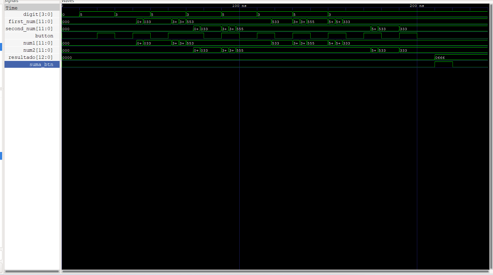

# Circuito sumador de números binarios

## 1. Abreviaturas y definiciones
- **FPGA**: Field Programmable Gate Arrays


## 2. Resumen
En el presente documento, se explica la implementación de un diseño digital en una FPGA, con el cual, se pretende elaborar un circuito sumador de números binarios. Se utilizan 3 subsistemas: un subsistema de lectura y registro de dos números decimales de 3 dígitos, que se ingresan en forma binaria; un subsistema de despliegue del resultado de la suma en display de 7 segmentos y un subsistema encargado de sumar los dos números ingresados.

## 3. Introducción
El presente documento, tiene como objetivo mostrar la elaboración de un sumador de números binarios, implementando un diseño digital en una FPGA. Para lograr lo anterior, se elaboró un subsistema de lectura y registro de los números ingresados, el cual, guarda cada digito de cada número, ingresado en formato binario, para luego ser enviado al subsistema encargado de sumar los dos números. Posteriormente, el resultado de la suma se despliega en el display de 7 segmentos.

También, para cada subsistema se elaboraron Testbench, para verificar el adecuado funcionamiento de cada módulo, antes de ser implementado en la FPGA. Finalmente se realizó la implementación en la FPGA, utilizando una protoboard, para lo cual, se usó como referencia el circuito mostrado en la siguiente imagen. 


## 3. Desarrollo

### 3.0 Descripción general del sistema

El sistema que se requiere elaborar es un sumador de dos números binarios, para lo cual, se plantea la realización de tres subsistemas: un subsistema de lectura y registro de los dos números de 3 dígitos en formato decimal, ingresados en formato binario; un subsistema encargado de sumar los dos números ingresados y un subsistema de despliegue del resultado de la suma de los dos números en display de 7 segmentos.
#### 1. Testbench
Para verificar el adecuado funcionamiento de los 3 subsistemas en conjunto, se realizó un Testbench. Primero se defnieron las señales de entrada, que se van a generar para probar el módulo, así como las señales de salida:
```SystemVerilog
    logic clk;
    logic rst;
    logic ag, bg, cg, dg; 
    logic suma_btn; 
    logic button; 
    logic [6:0] seg_unidades, seg_decenas, seg_centenas, seg_milesimas;
```
Posteriormente, se realiza la instanciación del módulo, mediante el cual, se van a conectar las entradas y salidas del módulo con las señales del testbench:
```SystemVerilog
     top uut (
        .clk(clk),
        .rst(rst),
        .ag(ag),
        .bg(bg),
        .cg(cg),
        .dg(dg),
        .suma_btn(suma_btn),
        .button(button),
        .seg_unidades(seg_unidades),
        .seg_decenas(seg_decenas),
        .seg_centenas(seg_centenas),
        .seg_milesimas(seg_milesimas)
    );
```
Luego, se define el funcionamiento del reloj:
```SystemVerilog
    initial begin
        clk = 0;
        forever #2 clk = ~clk; 
    end
```
Luego, se establecen los casos de entrada que se van a tener, estos casos simulan los números que se van a ingresar en el subsistema, además se establece que, para hacer un cambio en las señales se espere un tiempo de 10 nanosegundos:
```SystemVerilog
     
     initial begin
        // Inicialización
        rst = 1;
        ag = 0; bg = 0; cg = 0; dg = 0; 
        suma_btn = 0;
        button = 0;

        // Esperar un tiempo para la estabilización
        #10;
        rst = 0; // Desactivar el reset

        // Primer número: 5 (0101)
        button = 0; // Presionar botón
        ag = 0; bg = 1; cg = 0; dg = 1; // Introducir 5
        #10; // Esperar
        button = 1; // Liberar botón
        #10; // Esperar estabilización

        // Segundo número: 3 (0011)
        button = 0; // Presionar botón
        ag = 0; bg = 0; cg = 1; dg = 1; // Introducir 3
        #10; // Esperar
        button = 1; // Liberar botón
        #10; // Esperar estabilización
        //Primer número: 5 (0101)
        button = 0; // Presionar botón
        ag = 0; bg = 1; cg = 0; dg = 1; // Introducir 5
        #10; // Esperar
        button = 1; // Liberar botón
        #10; // Esperar estabilización

        // Segundo número: 3 (0011)
        button = 1; // Presionar botón
        ag = 0; bg = 0; cg = 1; dg = 1; // Introducir 3
        #10; // Esperar
        button = 0; // Liberar botón
        #10; // Esperar estabilización
        //Primer número: 5 (0101)
        button = 1; // Presionar botón
        ag = 0; bg = 1; cg = 0; dg = 1; // Introducir 5
        #10; // Esperar
        button = 0; // Liberar botón
        #10; // Esperar estabilización

        // Segundo número: 3 (0011)
        button = 1; // Presionar botón
        ag = 0; bg = 0; cg = 1; dg = 1; // Introducir 3
        #10; // Esperar
        button = 0; // Liberar botón
        #10; // Esperar estabilización
        //Primer número: 5 (0101)
        button = 1; // Presionar botón
        ag = 0; bg = 1; cg = 0; dg = 1; // Introducir 5
        #10; // Esperar
        button = 0; // Liberar botón
        #10; // Esperar estabilización

        // Segundo número: 3 (0011)
        button = 1; // Presionar botón
        ag = 0; bg = 0; cg = 1; dg = 1; // Introducir 3
        #10; // Esperar
        button = 0; // Liberar botón
        #10; // Esperar estabilización

         // Segundo número: 3 (0011)
        button = 1; // Presionar botón
        ag = 0; bg = 0; cg = 1; dg = 1; // Introducir 3
        #10; // Esperar
        button = 0; // Liberar botón
        #10; // Esperar estabilización

         // Segundo número: 3 (0011)
        button = 1; // Presionar botón
        ag = 0; bg = 0; cg = 1; dg = 1; // Introducir 3
        #10; // Esperar
        button = 0; // Liberar botón
        #10; // Esperar estabilización

        // Realizar suma
        suma_btn = 1; // Presionar botón de suma
        #10; // Esperar
        suma_btn = 0; // Liberar botón
        #10; // Esperar estabilización

        // Verificar resultados
        // Esperar a que se complete la división
        #10;
        // Finalizar la simulación
        $finish;
    end
```
Se imprimen los valores de las señales de salida, esto para verificar el adecuado funcionamiento de los módulos durante la simulación:
```SystemVerilog
     initial begin
        $monitor("Time: %0t | seg_unidades: %b | seg_decenas: %b | seg_centenas: %b | seg_milesimas: %b", 
                 $time, seg_unidades, seg_decenas, seg_centenas, seg_milesimas);
    end
```
El resultado que se obtuvo del test bench, es el mostrado en la siguiente imagen. Donde se observa que los dos números ingresados son 333 y se realiza correctamente la suma, la lectura de los números se da de número por medio, sin embargo, esto puede ser causado debido a los tiempos establecidos en la simulación:



### 3.1 Subsistema de lectura y registro de los números ingresados
#### 1. Encabezado del módulo
```SystemVerilog
module module_dipswitch (
    input logic clk,
    input logic rst,
    input logic ag, bg, cg, dg, // Entradas en código binario
    input logic button, // Botón para agregar el dígito
    output reg [11:0] first_num, // Guarda el primer número
    output reg [11:0] second_num // Guarda el segundo número
);
```
#### 2. Entradas y salidas:
- `ag, bg, cg, dg`: bits de entrada en código binario
- `reg [11:0] first_num,`: bits de salida que contienen el primer número
- `reg [11:0] second_num,`: bits de salida que contienen el segundo número

#### 3. Criterios de diseño
El presente subsistema recibe un código binario de 4 bits, el cual, representa cada dígito de los números que se requieren ingresar, los cuales, corresponden a dos números de 3 dígitos en formato decimal, que se ingresan en forma binaria al subsistema.

Una vez que se definen las entradas y salidas, se establecen los estados que va a tener la máquina de estados que va a encargarse de leer y guardar cada dígito de los dos números:
```SystemVerilog
typedef enum logic [2:0] {
        IDLE, // Estado inicial
        READ_FIRST, // Estado para leer el primer número
        READ_SECOND // Estado para leer el segundo número
    } statetype;
statetype state, nextstate; 
```
Luego, se definen las variables donde se van a guardar los dígitos que se ingresan y los contadores para cada número, que van a permitir identificar cuándo un número ya tiene sus 3 dígitos:

```SystemVerilog
    logic [3:0] digit; // Variable para almacenar el dígito binario
    logic [2:0] count_first; // Contador para el primer número
    logic [2:0] count_second; // Contador para el segundo número
    // Asigna las entradas directamente al dígito
    assign digit = {ag, bg, cg, dg};
```

Posteriormente, se establece mediante un flip-flop que, si se activa el reset los números y contadores se inicialicen en cero, mientras que si el reset no está activado, se pase al siguiente estado en la máquina de estados:

```SystemVerilog
// Registro de estado
    always_ff @(posedge clk or posedge rst) begin
        if (rst) begin
            state <= IDLE;
            first_num <= 12'b0;
            second_num <= 12'b0;
            count_first <= 0;
            count_second <= 0;
        end else begin
            state <= nextstate;
        end
    end
```
Fiinalmente, se establece la lógica del siguiente estado, en la cual, se establece que inicialmente el estado esté en IDLE que es con las variables en cero, luego si se lee que hay un dígito ingresado se pasa al siguiente estado en el cual se lee el primer número, manteniéndose en este estado, hasta que el número tenga 3 dígitos, esto se hace mediante un contador. Luego, si el primer número tiene los 3 dígitos, se pasa al siguiente estado, para leer los dígitos del segundo número, y una vez que este tiene los 3 dígitos pasa al estado IDLE. Además, cada dígito se ingresa después de presionar el botón:

```SystemVerilog
    // Lógica del siguiente estado
    always_ff @(posedge clk or posedge rst) begin
        if (rst) begin
            nextstate <= IDLE;
        end else begin
            case (state)
                IDLE: begin
                    if (button) begin
                        nextstate <= READ_FIRST; // Inicia la lectura del primer número
                    end else begin
                        nextstate <= IDLE;
                    end
                end
                READ_FIRST: begin
                    if (button) begin
                        // Agregar el nuevo dígito al primer número
                        first_num <= {first_num[7:0], digit}; // Almacena en formato binario
                        count_first <= count_first + 1;

                        // Cambiar al segundo número si se han leído 3 dígitos
                        if (count_first == 3) begin
                            nextstate <= READ_SECOND; // Cambia al segundo número
                        end
                    end else begin
                        nextstate <= READ_FIRST; // Mantiene el estado hasta que se presione el botón
                    end
                end
                READ_SECOND: begin
                    if (button) begin
                        // Agregar el nuevo dígito al segundo número
                        second_num <= {second_num[7:0], digit}; // Almacena en formato binario
                        count_second <= count_second + 1;

                        // Volver a IDLE si se han leído 3 dígitos
                        if (count_second == 3) begin
                            nextstate <= IDLE; // Vuelve a IDLE después de leer
                        end
                    end else begin
                        nextstate <= READ_SECOND; // Mantiene el estado hasta que se presione el botón
                    end
                end
                default: nextstate <= IDLE; // Estado por defecto
            endcase
        end
    end
```

#### 4. Testbench
Para verificar el adecuado funcionamiento del módulo, se realizó un testbench. Primero se defnieron las señales de entrada, que se van a generar para probar el módulo, así como las señales de salida:
```SystemVerilog
    logic clk;
    logic rst;
    logic ag, bg, cg, dg; // Entradas en código binario
    logic button; // Botón para agregar el dígito
    logic [11:0] first_num; // Salida para el primer número
    logic [11:0] second_num; // Salida para el segundo número

```
Posteriormente, se realiza la instanciación del módulo, mediante el cual, se van a conectar las entradas y salidas del módulo decoder con las señales del testbench:
```SystemVerilog
      module_dipswitch uut (
        .clk(clk),
        .rst(rst),
        .ag(ag),
        .bg(bg),
        .cg(cg),
        .dg(dg),
        .button(button),
        .first_num(first_num),
        .second_num(second_num)
    );
```
Luego, se establecen los casos de entrada que se van a tener, estos casos simulan el código binario que se va a ingresar en el subsistema, además se establece que, para hacer un cambio en las señales se espere un tiempo de 10 nanosegundos:
```SystemVerilog
 initial begin
        // Inicialización
        rst = 1; // Activar reset
        button = 0;
        ag = 0; bg = 0; cg = 0; dg = 0; // Inicializar entradas
        #10;
        
        rst = 0; // Desactivar reset

        // Prueba para el primer número (ejemplo: 123)
        // 1 (0001)
        ag = 0; bg = 0; cg = 0; dg = 1; 
        button = 1; #10; // Presionar el botón
        button = 0; #10; // Liberar el botón

        // 2 (0010)
        ag = 0; bg = 0; cg = 1; dg = 0; 
        button = 1; #10; 
        button = 0; #10;

        // 3 (0011)
        ag = 0; bg = 0; cg = 1; dg = 1; 
        button = 1; #10; 
        button = 0; #10;

        // Prueba para el segundo número (ejemplo: 456)
        // 4 (0100)
        ag = 0; bg = 1; cg = 0; dg = 0; 
        button = 1; #10; 
        button = 0; #10;

        // 5 (0101)
        ag = 0; bg = 1; cg = 0; dg = 1; 
        button = 1; #10; 
        button = 0; #10;

        // 6 (0110)
        ag = 0; bg = 1; cg = 1; dg = 0; 
        button = 1; #10; 
        button = 0; #10;

        // 7 (0101)
        ag = 0; bg = 1; cg = 0; dg = 1; 
        button = 1; #10; 
        button = 0; #10;

        // 8 (0110)
        ag = 0; bg = 1; cg = 1; dg = 0; 
        button = 1; #10; 
        button = 0; #10;

        // Finalización de la simulación
        #10;
        $finish;
    end
```
Finalmente, se definen los archivos que van a contener la información de las simulaciones:
```SystemVerilog
     initial begin
        $dumpfile("module_dipswitch_tb.vcd");
        $dumpvars(0, module_dipswitch_tb);
    end
```


### 3.2  Subsistema de despliegue de código ingresado traducido a formato binario en luces LED
#### 1. Encabezado del módulo
```SystemVerilog
module module_leds (
    input logic [3:0] binario,
    output reg[3:0] led
    );
```

#### 2. Entradas y salidas:
- `binario`: entrada de 4 bits, que proviene del subsistema de lectura y decodificación de código Gray.
- `led`: salida de 4 bits, que se encarga de manejar los leds en la FPGA.

#### 3. Criterios de diseño
El presente módulo recibe el código binario del módulo decoder y lo despliega en 4 leds que se encuentran en la FPGA. A continuación, se muestra el diagrama de bloques del subsistema:


Para lograr lo anterior, se le asigna a cada led, la condición de que se encienda si la señal de entrada binario coincide con los valores establecidos, en los cuales se requiere que el led esté encendido, para mostrar adecuadamente el valor binario. Además, la entrada binario debe negarse, ya que, en el módulo decoder la salida no se negó, lo anterior es necesario, para mostrar adecuadamente el código binario en los leds.
```SystemVerilog
 assign led[0] = ~((binario == 4'b0001)| (binario == 4'b0011)| (binario == 4'b0101) | (binario == 4'b0111) | (binario == 4'b1001)| (binario == 4'b1011) | (binario == 4'b1101) | (binario == 4'b1111)) ; 

    assign led[1] = ~((binario == 4'b0010) | (binario == 4'b0011) | (binario == 4'b0110) | (binario == 4'b0111) | (binario == 4'b1010) | (binario == 4'b1011) | (binario == 4'b1110) | (binario == 4'b1111)) ;

    assign led[2] = ~((binario== 4'b0100)| (binario == 4'b0101) | (binario == 4'b0111) | (binario == 4'b0110)| (binario == 4'b1100)| (binario == 4'b1101) | (binario == 4'b1111) | (binario == 4'b1110)) ;

    assign led[3] = ~((binario== 4'b1000)| (binario == 4'b1101) | (binario == 4'b1001) | (binario == 4'b1010)| (binario == 4'b1011)| (binario == 4'b1100) | (binario == 4'b1101) | (binario == 4'b1110) | (binario == 4'b1111));
 
```
#### 4. Testbench
Para verificar el adecuado funcionamiento del módulo, se realizó un testbench. Primero se defnieron las señales de entrada, que se van a generar para probar el módulo, así como las señales de salida. Se tiene una entrada de 4 bits y la salida que se despliega a los leds de 4 bits también:
```SystemVerilog
    logic [3:0] binario;
    logic [3:0] led;
```
Posteriormente, se realiza la instanciación del módulo, mediante el cual, se van a conectar las entradas y salidas del módulo leds con las señales del testbench:
```SystemVerilog
     module_leds uut (
        .binario(binario),
        .led(led)
    );
```
Luego, se establecen los casos de entrada que se van a tener, estos casos simulan las señales de salida del módulo decoder, el cual, decodifica el código Gray a binario. Además se establece que, para hacer un cambio en las señales se espere un tiempo de 10 nanosegundos y se muestre el estado de los leds:
```SystemVerilog
     
   initial begin

        binario = 4'b0000;
        #10;
        $display(led[3], led[2], led[1], led[0]);
        binario = 4'b0001;
        #10;  
        $display(led[3], led[2], led[1], led[0]);
        binario = 4'b0010;
        #10;  
        $display(led[3], led[2], led[1], led[0]);
        binario = 4'b0011;
        #10;  
        $display(led[3], led[2], led[1], led[0]);
        binario = 4'b0100;
        #10;  
        $display(led[3], led[2], led[1], led[0]);
        binario = 4'b0101;
        #10;  
        $display(led[3], led[2], led[1], led[0]);
        binario = 4'b0110;
        #10;  
        $display(led[3], led[2], led[1], led[0]);
        binario = 4'b0111;
        #10;  
        $display(led[3], led[2], led[1], led[0]);
        binario = 4'b1000;
        #10;  
        $display(led[3], led[2], led[1], led[0]);
        binario = 4'b1001;
        #10;  
        $display(led[3], led[2], led[1], led[0]);
        binario = 4'b1010;
        #10;  
        $display(led[3], led[2], led[1], led[0]);
        binario = 4'b1011;
        #10;  
        $display(led[3], led[2], led[1], led[0]);
        binario = 4'b1100;
        #10;  
        $display(led[3], led[2], led[1], led[0]);
        binario = 4'b1101;
        #10;  
        $display(led[3], led[2], led[1], led[0]);
        binario = 4'b1110;
        #10;  
        $display(led[3], led[2], led[1], led[0]);
        binario = 4'b1111;
        #10;  
        $display(led[3], led[2], led[1], led[0]);

        $finish;
    end
```
Finalmente, se definen los archivos que van a contener la información de las simulaciones:
```SystemVerilog
    initial begin
        $dumpfile("module_leds_tb.vcd");
        $dumpvars(0, module_leds_tb);
    end
```
Análisis de resultado:
Como se explicó en los criterios de diseño de este susbsitema, se debe negar la entrada recibida por el subsistema 1 para obtener una correcta representación del código binario decodificado en los LEDs, lo anterior se puede observar en el siguiente diagrama de tiempos del subsistema:


Se observa lo anteriormente explicado, y se asegura la correcta representación del código binario.

### 3.X Subsistema BCD
#### 1. Encabezado del módulo

```SystemVerilog
module module_divisor(
    input logic clk,
    input logic rst,
    input [15:0] numero_input,
    output logic [3:0] unidades_output,
    output logic [3:0] decenas_output,
    output logic [3:0] centenas_output,
    output logic [3:0] millares_output,
    output logic listo
    );
```

#### 2. Parámetros

- `temp` 
- `estado`
- `IDLE`
- `MILLARES`
- `CENTENAS`
- `DECENAS`
- `UNIDADES` 

#### 3. Entradas y salidas:

- `clk`: Señal del reloj que permite la actualización de los datos de entrada y salida.
- `rst`: Señal procedente del botón de reset que restablece los valores de entrada y salida a 0.
- `numero_input`: Valor de entrada binario de 16 bits, proveniente del módulo encargado de la suma aritmética.
- `unidades_output`: Valor de salida binario de 4 bits, esta salida representa las unidades en decimal del numero que entro en el subsistema.
- `decenas_output`: Valor de salida binario de 4 bits, esta salida representa las decenas en decimal del numero que entro en el subsistema.
- `centenas_output`: Valor de salida binario de 4 bits, esta salida representa las centenas en decimal del numero que entro en el subsistema.
- `millares_output`: Valor de salida binario de 4 bits, esta salida representa las millares en decimal del numero que entro en el subsistema.
- `listo`: Señal de salida que indica que el ciclo de obtención de resultados ha sido completado y da la indicación del próximo módulo de tomar los datos.

#### 4. Criterios de diseño

Este módulo tiene como objetivo el poder obtener por individualmente las unidades, decenas, centenas y millares; provenientes de un numero en binario.
Para el desarrollo de esta modulo se planteó una máquina de estados finitos o también conocidos como FSM. A continuación, se muestra el diagrama de la máquina de estados:


El estado `IDLE` tiene la función de asignar el `numero_input` a `temp` para así poder manipular esta variable de forma interna sin afectar o modificar la entrada. Además de restablecer los valores de salida a cero. Con ello se procede al siguiente estado siendo en este caso `MILLARES`.

El estado `MILLARES` tiene la función de obtener los millares del número `temp` para ello se estableció que si el `temp` es mayor o igual a mil, con ello a `millares_output` se le agregaría uno y a `temp` se le restarían mil; así hasta que `temp` sea menor a mil y se pase al siguiente estado siendo en este caso `CENTENAS`. A continuación, se muestra el código aplicado para cumplir esta condición:

```SystemVerilog
MILLARES: begin
    if (temp >= 1000) begin
        millares_output <= millares_output + 1;
        temp <= temp - 1000;
    end else begin
        estado <= CENTENAS;
    end
end
```

La misma lógica del estado `MILLARES` se aplica a los estados `CENTENAS` y `DECENAS`. Para el estado `UNIDADES` es un poco distinto debido a que el numero `temp` que ha sobrado de las operaciones anteriores en los estados anteriores seria nuestro `unidades_output` y la señal `listo` se activaría dando por completado el ciclo de esta máquina de estados para ello volver al estado inicial `IDLE`. A continuación, se muestra el código aplicado para cumplir esta condición:

```SystemVerilog
UNIDADES: begin
    unidades_output <= temp;
    estado <= IDLE;
    listo <= 1'b1;
end
```

#### 5. Testbench

Para verificar el adecuado funcionamiento del módulo, se realizó un testbench. Primero se definieron las señales de entrada, que se van a generar para probar el módulo, así como las señales de salida.

```SystemVerilog
    logic [15:0] numero_input;
    logic clk;
    logic rst;
    logic [3:0] unidades_output;
    logic [3:0] decenas_output;
    logic [3:0] centenas_output;
    logic [3:0] millares_output;
    logic listo;
```

Posteriormente, se realiza la instanciación del módulo, mediante el cual, se van a conectar las entradas y salidas del módulo con las señales del testbench:

```SystemVerilog
    module_divisor uut (
        .numero_input(numero_input),
        .clk(clk),
        .rst(rst),
        .unidades_output(unidades_output),
        .decenas_output(decenas_output),
        .centenas_output(centenas_output),
        .millares_output(millares_output),
        .listo(listo)
    );
```

Luego, se define el funcionamiento del reloj, con 10 unidades de tiempo para cada período y un retraso de 5 unidades de tiempo entre el flanco positivo y el negativo del reloj:

```SystemVerilog
    always begin
        clk = 1; 
        #5;
        clk = 0;
        #5;
    end
```

Con ello se inició la prueba planteando distintos casos, para observar los resultados se establece por medio del comando $display el cual permite verlos en el terminal; a continuación, se puede observar el código implementado.

```SystemVerilog
initial begin
    rst = 1;
    numero_input = 0;
    #10; 
    rst = 0; 
    #10; numero_input = 16'd1234;
    #10; wait(listo);
    #10;
    $display("Numero: %d, Millares: %d, Centenas: %d, Decenas: %d, Unidades: %d", numero_input, millares_output, centenas_output, decenas_output, unidades_output);
    #10; numero_input = 16'd5678;
    #10; wait(listo);
    #10; 
    $display("Numero: %d, Millares: %d, Centenas: %d, Decenas: %d, Unidades: %d", numero_input, millares_output, centenas_output, decenas_output, unidades_output);
    #10; numero_input = 16'd910; 
    #10; wait(listo);
    #10; 
    $display("Numero: %d, Millares: %d, Centenas: %d, Decenas: %d, Unidades: %d", numero_input, millares_output, centenas_output, decenas_output, unidades_output);
    #10; wait(listo);
    #10; 
    $display("Numero: %d, Millares: %d, Centenas: %d, Decenas: %d, Unidades: %d", numero_input, millares_output, centenas_output, decenas_output, unidades_output);
    #10;
    $finish;
end
```

### 3.X Subsistema de despliegue en 7 segmentos.
#### 1. Encabezado del módulo

```SystemVerilog
module module_divisor(
    input logic clk,
    input logic rst,
    input logic [3:0] unidades_input,
    input logic [3:0] decenas_input,
    input logic [3:0] centenas_input,
    input logic [3:0] milesimas_input,
    input logic listo,
    output logic [6:0] seg_unidades,
    output logic [6:0] seg_decenas,
    output logic [6:0] seg_centenas,
    output logic [6:0] seg_milesimas
    );
```

#### 2. Entradas y salidas:

- `clk`: Señal del reloj que permite la actualización de los datos de entrada y salida.
- `rst`: Señal procedente del botón de reset que restablece los valores de entrada y salida a 0.
- `unidades_input`:  Valor de entrada en binario de 4 bits, esta entrada representa las unidades que van del 0 al 9.
- `decenas_input`: Valor de entrada en binario de 4 bits, esta entrada representa las decenas que van del 0 al 9.
- `centenas_input`: Valor de entrada en binario de 4 bits, esta entrada representa las centenas que van del 0 al 9.
- `milesimas_input`: Valor de entrada en binario de 4 bits, esta entrada representa las millares que van del 0 al 9.
- `listo`: Señal de entrada que indica cuando los valores de entrada de unidades, decenas, centenas y millares esta listo para enseñarse en los 7 segmentos.
- `seg_unidades`: Es el conjunto de valores de salida que se conectan de los pines de la FPGA a los 7 segmentos, esta salida va conectada al 7 segmentos de unidades.
- `seg_decenas`: Es el conjunto de valores de salida que se conectan de los pines de la FPGA a los 7 segmentos, esta salida va conectada al 7 segmentos de decenas.
- `seg_centenas`: Es el conjunto de valores de salida que se conectan de los pines de la FPGA a los 7 segmentos, esta salida va conectada al 7 segmentos de centenas.
- `seg_milesimas`: Es el conjunto de valores de salida que se conectan de los pines de la FPGA a los 7 segmentos, esta salida va conectada al 7 segmentos de millares.

#### 3. Criterios de diseño

Este módulo tiene como objetivo el mostrar en decimales las unidades, decenas, centenas y millares; en los dispositivos 7 segmentos los cuales se encuentran conectados con distintos pines de la FPGA.
Para el desarrollo de este módulo se planteó 4 case los cuales representan las unidades, decenas, centenas y millares; los cuales se desarrollan en simultaneo para así poder ver los valores en conjunto.

Para los valores de `unidades_input` se plantean si el valor de entrada en decimal se encuentra entre 0 y 9; siendo alguno de estos casos la señal de salida se daría en un conjunto de 7 bits que representan los segmentos a, b, c, d, e, f y g; esto se puede observar como el siguiente formato `7'babc_defg`. Por último, se plantea un caso default debido al hipotético caso que ninguna de las condiciones se cumpla, pero por la estructura del código esta situación no debería de ocurrir. Esta logica se aplica de igual manera para las `decenas_input`, `centenas_input` y `milesimas_input`. A continuación, se muestra el código aplicado para cumplir esta condición:

```SystemVerilog
case (unidades)
    4'd0: seg_unidades <= 7'b111_1110;
    4'd1: seg_unidades <= 7'b011_0000;
    4'd2: seg_unidades <= 7'b110_1101;
    4'd3: seg_unidades <= 7'b111_1001;
    4'd4: seg_unidades <= 7'b011_0011;
    4'd5: seg_unidades <= 7'b101_1011;
    4'd6: seg_unidades <= 7'b101_1111;
    4'd7: seg_unidades <= 7'b111_0000;
    4'd8: seg_unidades <= 7'b111_1111;
    4'd9: seg_unidades <= 7'b111_1011;
    default:  seg_unidades <= 7'b000_0000;
endcase
```

Por ultimo se establece la condicion en la cual activa el boton de `rst` que da la señal a los 7 segmentos de proyectar un cero. A continuación, se muestra el código aplicado para cumplir esta condición:

```SystemVerilog
if (rst) begin
    seg_unidades <= 7'b111_1110; 
    seg_decenas <= 7'b111_1110; 
    seg_centenas <= 7'b111_1110; 
    seg_milesimas <= 7'b111_1110; 
end
```

#### 4. Testbench

Para verificar el adecuado funcionamiento del módulo, se realizó un testbench. Primero se definieron las señales de entrada, que se van a generar para probar el módulo, así como las señales de salida.

```SystemVerilog
    logic clk;
    logic rst;
    logic [3:0] unidades_input;
    logic [3:0] decenas_input;
    logic [3:0] centenas_input;
    logic [3:0] milesimas_input;
    logic listo;
    logic [6:0] seg_unidades;
    logic [6:0] seg_decenas;
    logic [6:0] seg_centenas;
    logic [6:0] seg_milesimas;
```

Posteriormente, se realiza la instanciación del módulo, mediante el cual, se van a conectar las entradas y salidas del módulo con las señales del testbench.

```SystemVerilog
module_seg uut (
    .clk(clk),
    .rst(rst),
    .unidades_input(unidades_input),
    .decenas_input(decenas_input),
    .centenas_input(centenas_input),
    .milesimas_input(milesimas_input),
    .listo(listo),
    .seg_unidades(seg_unidades),
    .seg_decenas(seg_decenas),
    .seg_centenas(seg_centenas),
    .seg_milesimas(seg_milesimas)
);
```

Luego, se establecen los casos de entrada que se van a tener, estos casos simulan las señales de salida del módulo divisor los cuales van cambiando cada 10 unidades de tiempo.

```SystemVerilog
initial begin
    rst = 1;
    unidades_input = 4'd0;
    decenas_input = 4'd0;
    centenas_input = 4'd0;
    milesimas_input = 4'd0;
    listo = 0;
    #10;
    rst = 0;
    #10;
    unidades_input = 4'd9;
    decenas_input = 4'd0;
    centenas_input = 4'd6;
    milesimas_input = 4'd7;
    listo = 1;
    listo = 0;
    #10;
    unidades_input = 4'd3;
    decenas_input = 4'd9;
    centenas_input = 4'd1;
    milesimas_input = 4'd3;
    listo = 1;
    listo = 0;
    #10;
    unidades_input = 4'd4;
    decenas_input = 4'd9;
    centenas_input = 4'd0;
    milesimas_input = 4'd0;
    listo = 1;
    listo = 0;
    #1000;
    $finish;
end
```

Finalmente, se definen los archivos que van a contener la información de las simulaciones:

```SystemVerilog
initial begin
    $dumpfile("module_seg_tb.vcd");
    $dumpvars(0,module_seg_tb);
end 
```

## 4. Consumo de recursos
Mediante la realización de la síntesis del módulo Top, el cual, se encarga de llamar a los 3 subsistemas e integralos, se obtuvo el siguiente consumo de recursos:
```SystemVerilog
    === module_top ===

   Number of wires:                240
   Number of wire bits:            838
   Number of public wires:         240
   Number of public wire bits:     838
   Number of memories:               0
   Number of memory bits:            0
   Number of processes:              0
   Number of cells:                412
     ALU                           102
     DFFC                            8
     DFFCE                          76
     DFFP                           22
     GND                             1
     IBUF                            8
     LUT1                           19
     LUT2                           21
     LUT3                           13
     LUT4                           63
     MUX2_LUT5                      33
     MUX2_LUT6                      16
     MUX2_LUT7                       1
     OBUF                           28
     VCC                             1
```

Además, se obtuvieron los siguientes resultados de uso:
```SystemVerilog
    
Info: Device utilisation:
Info: 	                 VCC:     1/    1   100%
Info: 	               SLICE:   294/ 8640     3%
Info: 	                 IOB:    36/  274    13%
Info: 	                ODDR:     0/  274     0%
Info: 	           MUX2_LUT5:    33/ 4320     0%
Info: 	           MUX2_LUT6:    16/ 2160     0%
Info: 	           MUX2_LUT7:     1/ 1080     0%
Info: 	           MUX2_LUT8:     0/ 1056     0%
Info: 	                 GND:     1/    1   100%
Info: 	                RAMW:     0/  270     0%
Info: 	                 GSR:     1/    1   100%
Info: 	                 OSC:     0/    1     0%
Info: 	                rPLL:     0/    2     0%
```


## 5. Conclusiones
Mediante el uso de lógica combinacional, utilizando ecuaciones booleanas, y lógica secuencial, se logró realizar el decodificador de código Gray a binario y se logró el despliegue de manera adecuada, del código binario a los leds y 7 segmentos.

## 6. Problemas encontrados durante el proyecto
Se tuvieron problemas con el módulo Top, que se encarga de llamar a los 3 subsistemas e integralos, ya que, se estaban realizando las instanciaciones de manera incorrecta, sin embargo, se logró identificar el problema y se corrigió.

## 7. Recomendaciones
Siempre analizar cuál puede ser el mejor método de simplificación de ecuaciones booleanas, que permita realizar las simplificaciones de manera más sencilla y rápida.
## 6. Referencias
[0] David Harris y Sarah Harris. *Digital Design and Computer Architecture. RISC-V Edition.* Morgan Kaufmann, 2022. ISBN: 978-0-12-820064-3
