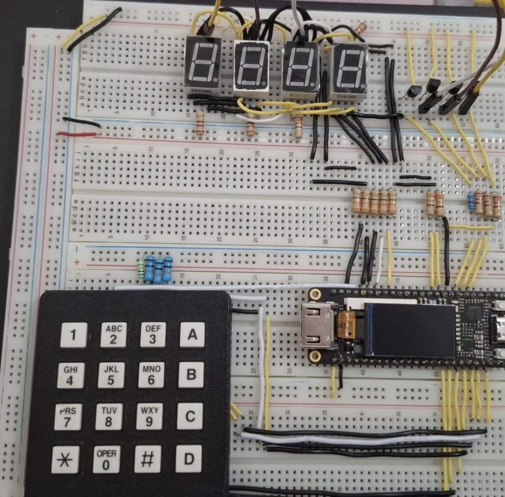
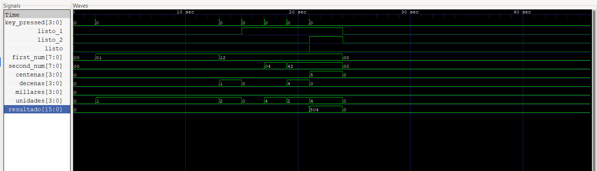
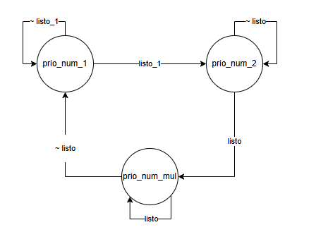
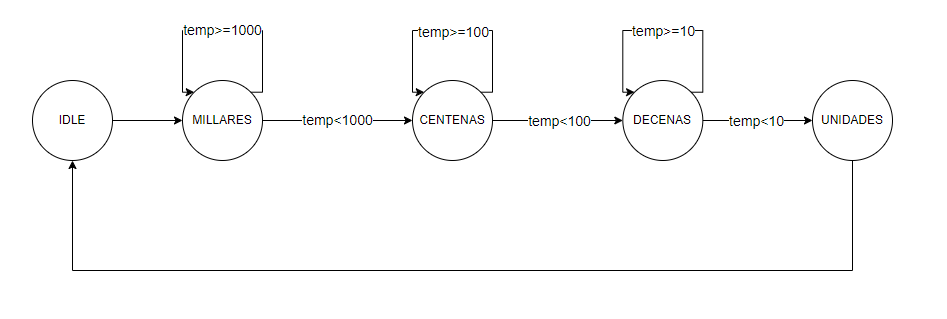
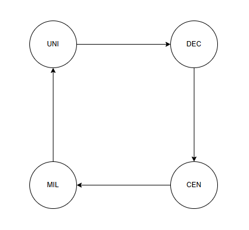
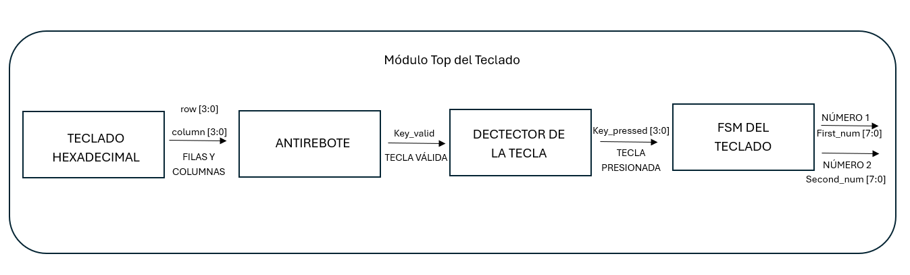
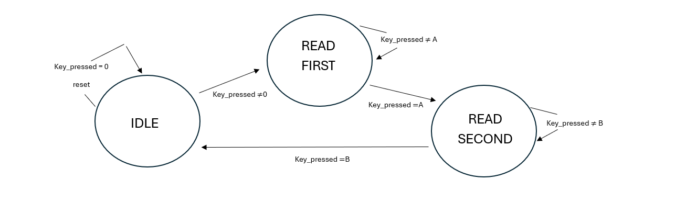
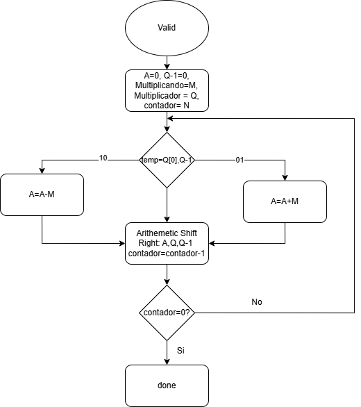
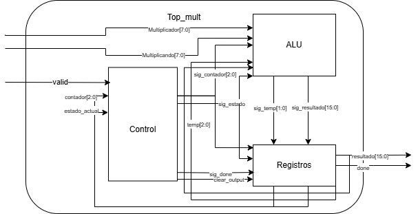

# Multiplicador y despliegue en 7 segmentos con teclado hexadecimal

## 1. Abreviaturas y definiciones
- **FPGA**: Field Programmable Gate Arrays
- **FSM**: Máquina de estados finitos

## 2. Resumen
En el presente documento, se explica la implementación de un diseño digital en una FPGA, con el cual, se pretende elaborar un circuito multilicador de números binarios. Se utilizan 3 subsistemas: un subsistema de lectura y registro de dos números decimales de 2 dígitos ingresados mediante un teclado hexadecimal, que se ingresan en forma binaria; un subsistema de despliegue del resultado de la suma en display de 7 segmentos y un subsistema encargado de multiplicar los dos números ingresados.

## 3. Introducción
El presente documento, tiene como objetivo mostrar la elaboración de un multiplicador de números binarios, implementando un diseño digital en una FPGA. Para lograr lo anterior, se elaboró un subsistema de lectura y registro de los números ingresados, el cual, guarda cada dígito de cada número, ingresado en formato binario, para luego ser enviado al subsistema encargado de multiplicar los dos números. Posteriormente, el resultado de la multiplicación se despliega en el display de 7 segmentos.

También, para cada subsistema se elaboraron Testbench, para verificar el adecuado funcionamiento de cada módulo, antes de ser implementado en la FPGA. Finalmente se realizó la implementación en la FPGA, utilizando una protoboard, para lo cual, se usó como referencia el circuito mostrado en la siguiente imagen.



### 4.0 Descripción general del sistema
El sistema que se requiere elaborar es un multiplicador de dos números binarios, para lo cual, se plantea la realización de tres subsistemas: un subsistema de lectura y registro de los dos números de 2 dígitos en formato decimal, ingresados mediante un teclado hexadecimal; un subsistema encargado de multilicar los dos números ingresados y un subsistema de despliegue del resultado de la multiplicación de los dos números en display de 7 segmentos. A continuación, se muestra el diagrama de bloques de la interconexión de los subsistemas en el top general.


#### 1.Testbench
Para verificar el adecuado funcionamiento de los 3 subsistemas en conjunto, se realizó un Testbench. Primero se defnieron las señales de entrada, que se van a generar para probar el módulo, así como las señales de salida:
```SystemVerilog
logic clk;
    logic rst;
    logic [3:0] column;
    logic [3:0] row;
    logic [6:0] seg;
    logic [3:0] transis;
```
Se instanció el módulo requerido para realizar la simulación:
```SystemVerilog
 module_top_general uut (
        .clk(clk),
        .rst(rst),
        .column(column),
        .row(row),
        .seg(seg),
        .transis(transis)
    );
```
Se generó un clk de un 1 kHz y se ingresaron dos números indicando la fila y columna de cada número:
```SystemVerilog
// Generación del reloj a 1 kHz
    always begin
       clk = 0; #0.5;   // 500,000 ns = 0.5 ms (bajo)
       clk = 1; #0.5;   // 500,000 ns = 0.5 ms (alto)
    end

    initial begin
       // Inicialización
       rst = 1;
       row = 4'b1111;
       column = 4'b1111;
       #1000;  
       rst = 0;
       #1000;   

       // Tecla 1
       row = 4'b1110;
       column = 4'b1110;
       #10000;   
       // Liberar tecla
       row = 4'b1111;
       column = 4'b1111;
       #1000;  
       
       // Tecla 2
       row = 4'b1110;
       column = 4'b1101;
       #1000;   
       // Liberar tecla
       row = 4'b1111;
       column = 4'b1111;
       #1000;   
       
       // Tecla A (10)
       row = 4'b1110;
       column = 4'b0111;
       #1000;   
       // Liberar tecla
       row = 4'b1111;
       column = 4'b1111;
       #1000;  

       
       // Tecla 4
       row = 4'b1101;
       column = 4'b1110;
       #1000;   
       // Liberar tecla
       row = 4'b1111;
       column = 4'b1111;
       #1000;   

       
      // Tecla 2
       row = 4'b1110;
       column = 4'b1101;
       #1000;
       // Liberar tecla
       row = 4'b1111;
       column = 4'b1111;
       #1000;  

       // Tecla B (11)
       row = 4'b1101;
       column = 4'b0111;
       #1000;  
       // Liberar tecla
       row = 4'b1111;
       column = 4'b1111;
       #1000;   
```
Del testbench anterior, se obtuvieron los siguientes resultados, donde se observa el correcto ingreso de los números 12 y 42, el resultado de la multiplicación y el adecuado despliegue en los 7 segmentos:



### 4.1 Módulo de prioridad de 7 segmentos
#### 1. Encabezado del módulo

```SystemVerilog
module module_prio (
    input logic clk,
    input logic rst,
    input logic [7:0] num_1,
    input logic [7:0] num_2,
    input logic listo_1,
    input logic listo_2,
    input logic listo,
    input logic [15:0] num_mul,
    output logic [15:0] numero_output
    );
```

#### 2. Parámetros

- `prioridad`
- `prio_num_1`
- `prio_num_2`
- `prio_num_mul`

#### 3. Entradas y salidas:

- `clk`: Señal del reloj que permite la actualización de los datos de entrada y salida.
- `rst`: Señal procedente del botón de reset que restablece los valores de entrada y salida a 0.
- `num_1`: Valor de entrada binario de 8 bits, este valor proviene del módulo del teclado y representa al primer número de la operación que se realiza.
- `num_2`: Valor de entrada binario de 8 bits, este valor proviene del módulo del teclado y representa al segundo numero de la operación que se realiza.
- `listo_1`: Valor de entrada binario, este valor proviene del módulo del teclado y indica cuando se a digitado completamente el primer número de la operación.
- `listo`: Valor de entrada binario, este valor proviene del módulo del teclado y indica cuando se a digitado completamente el segundo numero de la operación.
- `num_mul`: Valor de entrada binario de 16 bits, este valor proviene del módulo de la operación realizada. 
- `numero_output`: Valor de salida binario de 16 bits, este valor representa el valor que pasaría el módulo BCD para posteriormente mostrarse en los 7 segmentos.

#### 4. Criterios de diseño

Este módulo tiene como objetivo el poder determinar qué valor se estaría presentando en los 7 segmentos en base al orden establecido. Para esto se hace uso de dos señales (`listo_1` y `listo`) provenientes del módulo del teclado. En caso de que se active el `rst` se establece la prioridad por defecto.



```SystemVerilog
always_ff @(posedge clk or posedge rst) begin
    if (rst) begin
        prioridad <= prio_num_1;
    end else begin
        if (listo) begin
            prioridad <= prio_num_mul;
        end else begin
            if (listo_1) begin
                prioridad <= prio_num_2; 
            end else begin
                    prioridad <= prio_num_1;
            end
        end
    end
end
```

En base a la prioridad asignada se establece el valor a la salida `numero_output` que se conecta con el módulo BCD cada vez que la prioridad cambie.

```SystemVerilog
always_comb begin
    case (prioridad)
        prio_num_1:begin
            numero_output = num_1;
        end 
        prio_num_2:begin
            numero_output = num_2;
        end
        prio_num_mul:begin
            numero_output = num_mul;
        end
        default: begin
            numero_output = 16'd0;
        end
    endcase
end
```

#### 5. Testbench

Para verificar el adecuado funcionamiento del módulo, se realizó un testbench. Primero se definieron las señales de entrada, que se van a generar para probar el módulo, así como las señales de salida.

```SystemVerilog
logic clk;
logic rst;
logic [7:0] num_1;
logic [7:0] num_2;
logic listo_1;
logic listo;
logic [15:0] num_mul;
logic [15:0] numero_output;
```

Posteriormente, se realiza la instanciación del módulo, mediante el cual, se van a conectar las entradas y salidas del módulo con las señales del testbench.

```SystemVerilog
module_prio uut (
    .clk(clk),
    .rst(rst),
    .num_1(num_1),
    .num_2(num_2),
    .listo_1(listo_1),
    .listo(listo),
    .num_mul(num_mul),
    .numero_output(numero_output)
);
```

Luego, se define el funcionamiento del reloj, con 10 unidades de tiempo para cada período y un retraso de 5 unidades de tiempo entre el flanco positivo y el negativo del reloj:

```SystemVerilog
    always begin
        clk = 1; 
        #5;
        clk = 0;
        #5;
    end
```

Luego, se establecen los casos de entrada que se van a tener, estos casos simulan las señales de salida del módulo divisor los cuales van cambiando cada 10 unidades de tiempo.

```SystemVerilog
initial begin
    rst = 1;
    #10;
    rst = 0;
    #10;
    num_1 = 16'd15;
    num_2 = 16'd10;
    num_mul = 16'd150;
    #10;
    listo_1 = 1;
    #10;
    listo = 1;
    #100;
    $finish;
    
end
```

Finalmente, se definen los archivos que van a contener la información de las simulaciones.

```SystemVerilog
initial begin
    $dumpfile("module_prio_tb.vcd");
    $dumpvars(0,module_prio_tb);
end 
```

### 4.2 Módulo BCD
#### 1. Encabezado del módulo

```SystemVerilog
module module_BCD(
    input logic clk,
    input logic rst,
    input [15:0] numero_input,
    output logic [3:0] unidades_output,
    output logic [3:0] decenas_output,
    output logic [3:0] centenas_output,
    output logic [3:0] millares_output,
    output logic listo
    );
```

#### 2. Parámetros

- `temp`
- `estado`
- `IDLE`
- `MILLARES`
- `CENTENAS`
- `DECENAS`
- `UNIDADES` 

#### 3. Entradas y salidas:

- `clk`: Señal del reloj que permite la actualización de los datos de entrada y salida.
- `rst`: Señal procedente del botón de reset que restablece los valores de entrada y salida a 0.
- `numero_input`: Valor de entrada binario de 16 bits, proveniente del módulo de prioridad.
- `unidades_output`: Valor de salida binario de 4 bits, esta salida representa las unidades en decimal del número que entro en el subsistema.
- `decenas_output`: Valor de salida binario de 4 bits, esta salida representa las decenas en decimal del número que entro en el subsistema.
- `centenas_output`: Valor de salida binario de 4 bits, esta salida representa las centenas en decimal del número que entro en el subsistema.
- `millares_output`: Valor de salida binario de 4 bits, esta salida representa los millares en decimal del número que entro en el subsistema.
- `listo`: Señal de salida que indica que el ciclo de obtención de resultados ha sido completado y da la indicación del próximo módulo de tomar los datos.

#### 4. Criterios de diseño

Este módulo tiene como objetivo el poder obtener por individualmente las unidades, decenas, centenas y millares; provenientes de un numero en binario.
Para el desarrollo de esta modulo se planteó una máquina de estados finitos o también conocidos como FSM. A continuación, se muestra el diagrama de la máquina de estados:



El estado `IDLE` tiene la función de asignar el `numero_input` a `temp` para así poder manipular esta variable de forma interna sin afectar o modificar la entrada. Además de restablecer los valores de salida a cero. Con ello se procede al siguiente estado siendo en este caso `MILLARES`.

El estado `MILLARES` tiene la función de obtener los millares del número `temp` para ello se estableció que si el `temp` es mayor o igual a mil, con ello a `millares_output` se le agregaría uno y a `temp` se le restarían mil; así hasta que `temp` sea menor a mil y se pase al siguiente estado siendo en este caso `CENTENAS`. A continuación, se muestra el código aplicado para cumplir esta condición:

```SystemVerilog
MILLARES: begin
    if (temp >= 1000) begin
        millares_output <= millares_output + 1;
        temp <= temp - 1000;
    end else begin
        estado <= CENTENAS;
    end
end
```

La misma lógica del estado `MILLARES` se aplica a los estados `CENTENAS` y `DECENAS`. Para el estado `UNIDADES` es un poco distinto debido a que el numero `temp` que ha sobrado de las operaciones anteriores en los estados anteriores seria nuestro `unidades_output` y la señal `listo` se activaría dando por completado el ciclo de esta máquina de estados para ello volver al estado inicial `IDLE`. A continuación, se muestra el código aplicado para cumplir esta condición:

```SystemVerilog
UNIDADES: begin
    unidades_output <= temp;
    estado <= IDLE;
    listo <= 1'b1;
end
```

#### 5. Testbench

Para verificar el adecuado funcionamiento del módulo, se realizó un testbench. Primero se definieron las señales de entrada, que se van a generar para probar el módulo, así como las señales de salida.

```SystemVerilog
logic [15:0] numero_input;
logic clk;
logic rst;
logic [3:0] unidades_output;
logic [3:0] decenas_output;
logic [3:0] centenas_output;
logic [3:0] millares_output;
logic listo;
```

Posteriormente, se realiza la instanciación del módulo, mediante el cual, se van a conectar las entradas y salidas del módulo con las señales del testbench:

```SystemVerilog
module_BCD uut (
    .numero_input(numero_input),
    .clk(clk),
    .rst(rst),
    .unidades_output(unidades_output),
    .decenas_output(decenas_output),
    .centenas_output(centenas_output),
    .millares_output(millares_output),
    .listo(listo)
);
```

Luego, se define el funcionamiento del reloj, con 10 unidades de tiempo para cada período y un retraso de 5 unidades de tiempo entre el flanco positivo y el negativo del reloj:

```SystemVerilog
always begin
    clk = 1; 
    #5;
    clk = 0;
    #5;
end
```

Con ello se inició la prueba planteando distintos casos, para observar los resultados se establece por medio del comando $display el cual permite verlos en el terminal; a continuación, se puede observar el código implementado.

```SystemVerilog
initial begin
    rst = 1;
    numero_input = 0;
    #10; 
    rst = 0; 
    #10; numero_input = 16'd1234;
    #10; wait(listo);
    #10;
    $display("Numero: %d, Millares: %d, Centenas: %d, Decenas: %d, Unidades: %d", numero_input, millares_output, centenas_output, decenas_output, unidades_output);
    #10; numero_input = 16'd5678;
    #10; wait(listo);
    #10; 
    $display("Numero: %d, Millares: %d, Centenas: %d, Decenas: %d, Unidades: %d", numero_input, millares_output, centenas_output, decenas_output, unidades_output);
    #10; numero_input = 16'd910; 
    #10; wait(listo);
    #10; 
    $display("Numero: %d, Millares: %d, Centenas: %d, Decenas: %d, Unidades: %d", numero_input, millares_output, centenas_output, decenas_output, unidades_output);
    #10; wait(listo);
    #10; 
    $display("Numero: %d, Millares: %d, Centenas: %d, Decenas: %d, Unidades: %d", numero_input, millares_output, centenas_output, decenas_output, unidades_output);
    #10;
    $finish;
end
```

### 4.3 Módulo de despliegue en los 7 segmentos
#### 1. Encabezado del módulo

```SystemVerilog
module module_seg (
    input logic clk,
    input logic rst,
    input logic [3:0] unidades_input,
    input logic [3:0] decenas_input,
    input logic [3:0] centenas_input,
    input logic [3:0] millares_input,
    input logic listo,
    output logic [6:0] seg,
    output logic [3:0] transis
    );
```

#### 2. Parámetros

- `unidades`
- `decenas`
- `centenas`
- `millares`
- `numero`
- `selec`
- `UNI`
- `DEC`
- `CEN`
- `MIL`

#### 3. Entradas y salidas:

- `clk`: Señal del reloj que permite la actualización de los datos de entrada y salida.
- `rst`: Señal procedente del botón de reset que restablece los valores de entrada y salida a 0.
- `unidades_input`:  Valor de entrada en binario de 4 bits, esta entrada representa las unidades que van del 0 al 9.
- `decenas_input`: Valor de entrada en binario de 4 bits, esta entrada representa las decenas que van del 0 al 9.
- `centenas_input`: Valor de entrada en binario de 4 bits, esta entrada representa las centenas que van del 0 al 9.
- `milesimas_input`: Valor de entrada en binario de 4 bits, esta entrada representa los millares que van del 0 al 9.
- `listo`: Señal de entrada que indica cuando los valores de entrada de unidades, decenas, centenas y millares está listo para enseñarse en los 7 segmentos.
- `seg`: Es el conjunto de valores de salida que se conectan de los pines de la FPGA a los 7 segmentos.
- `transis`: Es el conjunto de valores de salida que se conectan de los pines de la FPGA a los transistores que activan o desactivan los 7 segmentos.

#### 4. Criterios de diseño
Este módulo tiene como objetivo el mostrar en decimales las unidades, decenas, centenas y millares; en los dispositivos 7 segmentos los cuales se encuentran conectados con distintos pines de la FPGA.
Para el desarrollo de este módulo se planteó que las entradas de los 7 segmentos estuvieran conectadas en paralelo, los cuales alternan su activación por medio de los transistores y de esta forma se mostrara los valores de unidades, decenas, centenas y millares. El módulo se encuentra estructura de la siguiente forma:

Se asignan los datos de entrada provenientes del módulo BCD a las variables internas únicamente se da cuando la señal de `listo` del BCD este activada para que lo presentado en los 7 segmentos se un numero completo correctamente decodificado; de igual forma en esta sección se restablece los valores internos cuando se activa el `rst`.

```SystemVerilog
always_ff @(posedge clk or posedge rst) begin
    if (rst) begin
        unidades <= 4'd0;
        decenas <= 4'd0;
        centenas <= 4'd0;
        millares <= 4'd0;
    end 
end
```

```SystemVerilog
always_comb begin
    if (listo) begin
        unidades = unidades_input;
        decenas = decenas_input;
        centenas = centenas_input;
        millares = millares_input;
    end
end
```

Se establece una máquina de estados la cual cambia de estado en cada flanco de reloj, como se muestra a continuación.



```SystemVerilog
always_ff @(posedge clk) begin
    if (rst) begin
        selec <= 2'd0;
    end else begin
        selec <= (selec + 1) % 4;
    end
end
```

En esta máquina de estados se establece cuál de los valores internos (`unidades`, `decenas`, `centenas`, `millares`) se está proyectando en los 7 segmentos a su vez se activan y desactivan los transistores de cada uno de estos.

```SystemVerilog
always_comb begin 
    case (selec)
        UNI:begin
            numero = unidades;
            transis = 4'b0001;
        end
        DEC:begin
            numero = decenas;
            transis = 4'b0010;
        end
        CEN:begin
            numero = centenas;
            transis = 4'b0100;
        end
        MIL:begin
            numero = millares;
            transis = 4'b1000;
        end
        default: begin
            numero = 4'd0;
            transis = 4'b0000;
        end
    endcase
end
```

Para los valores presentados `numero` se plantea con lógica combinacional para así que cada vez que este valor cambie se actualice el dato de salida a los 7 segmentos, esta salida `seg` se daría en un conjunto de 7 bits que representan los segmentos a, b, c, d, e, f y g; esto se puede observar como el siguiente formato `7'babcdefg`.

```SystemVerilog
always_comb begin
    case (numero)
        4'd0: seg = 7'b0000001;
        4'd1: seg = 7'b1001111;
        4'd2: seg = 7'b0010010;
        4'd3: seg = 7'b0000110;
        4'd4: seg = 7'b1001100;
        4'd5: seg = 7'b0100100;
        4'd6: seg = 7'b0100000;
        4'd7: seg = 7'b0001111;
        4'd8: seg = 7'b0000000;
        4'd9: seg = 7'b0000100;
        default: seg = 7'b0110110;
    endcase
end
```

#### 5. Testbench

Para verificar el adecuado funcionamiento del módulo, se realizó un testbench. Primero se definieron las señales de entrada, que se van a generar para probar el módulo, así como las señales de salida.

```SystemVerilog
logic clk;
logic rst;
logic [3:0] unidades_input;
logic [3:0] decenas_input;
logic [3:0] centenas_input;
logic [3:0] milesimas_input;
logic listo;
logic [6:0] seg;
logic [3:0] transis;
```

Posteriormente, se realiza la instanciación del módulo, mediante el cual, se van a conectar las entradas y salidas del módulo con las señales del testbench.

```SystemVerilog
module_seg uut (
    .clk(clk),
    .rst(rst),
    .unidades_input(unidades_input),
    .decenas_input(decenas_input),
    .centenas_input(centenas_input),
    .millares_input(millares_input),
    .listo(listo),
    .seg(seg),
    .transis(transis)
);
```

Luego, se define el funcionamiento del reloj, con 10 unidades de tiempo para cada período y un retraso de 5 unidades de tiempo entre el flanco positivo y el negativo del reloj:

```SystemVerilog
always begin
    clk = 1; 
    #5;
    clk = 0;
    #5;
end
```

Luego, se establecen los casos de entrada que se van a tener, estos casos simulan las señales de salida del módulo divisor los cuales van cambiando cada 10 unidades de tiempo.

```SystemVerilog
initial begin
    rst = 1;
    unidades_input = 4'd0;
    decenas_input = 4'd0;
    centenas_input = 4'd0;
    millares_input = 4'd0;
    listo = 0;
    #10;
    rst = 0;
    #40;
    unidades_input = 4'd9;
    decenas_input = 4'd0;
    centenas_input = 4'd6;
    millares_input = 4'd7;
    listo = 1;
    #10;
    listo = 0;
    #40;
    unidades_input = 4'd3;
    decenas_input = 4'd9;
    centenas_input = 4'd1;
    millares_input = 4'd3;
    listo = 1;
    #10;
    listo = 0;
    #40;
    unidades_input = 4'd4;
    decenas_input = 4'd9;
    centenas_input = 4'd0;
    millares_input = 4'd0;
    listo = 1;
    #10;
    listo = 0;
    #100;
    $finish;   
end
```

Finalmente, se definen los archivos que van a contener la información de las simulaciones.

```SystemVerilog
initial begin
    $dumpfile("module_seg_tb.vcd");
    $dumpvars(0,module_seg_tb);
end 
```
### 4.4 Módulo anti rebote para teclado hexadecimal
#### 1. Encabezado del módulo
```SystemVerilog
module module_anti_rebote (
    input logic clk,              
    input logic rst,              
    input logic [3:0] row,        
    input logic [3:0] column,     
    output logic [3:0] key_out    
);
```
#### 2. Entradas y salidas
- `row`: filas de entrada del teclado hexadecimal
- `column`: columnas de entrada del teclado hexadecimal
- `key_out`: salida que indica si la tecla es válida

#### 3. Criterios de diseño
Este módulo se encarga de eliminar los rebotes del teclado matricial, y asegura que, en el procesamiento de las señales, solo se consideren entradas estables y válidas de entrada. Para esto, se hace uso de un contador para verificar si la señal de entrada del teclado, se mantiene estable durante una cantidad determinada de ciclos de reloj.
```SystemVerilog
    parameter DEBOUNCE_COUNT = 100000;  

    
    logic [15:0] keys_stable;     
    logic [15:0] keys_sampled;     
    logic [31:0] debounce_counter; 

    
    logic [3:0] row_reg;
    logic [3:0] col_reg;

    
    always_ff @(posedge clk or posedge rst) begin
        if (rst) begin
            row_reg <= 4'b1111;          
            col_reg <= 4'b1111;          
            debounce_counter <= 0;
            keys_stable <= 16'b0;
            keys_sampled <= 16'b0;
        end else begin
           
            col_reg <= {col_reg[2:0], 1'b1};  

            
            row_reg <= row;  

           
            keys_sampled <= {keys_sampled[14:0], row_reg}; 

           
            if (debounce_counter < DEBOUNCE_COUNT) begin
                debounce_counter <= debounce_counter + 1;
            end else begin
                if (keys_sampled == keys_stable) begin
                    keys_stable <= keys_sampled; 
                end
                debounce_counter <= 0; 
            end
        end
    end

    
    always_comb begin
       
        key_out = ~(keys_sampled[3:0] ^ keys_stable[3:0]); 
    end

endmodule
```

#### 4. Testbench
Para verificar el funcionamiento del módulo de antirebote, se realizó un testbench para compribar los casos de rebote y sin rebote. Primeramente, se definieron las señales que se conectan al módulo de antirebote:

```SystemVerilog
    logic clk;
    logic rst;
    logic [3:0] rows;
    logic [3:0] columns;
    logic [3:0] key_out;
```

Posteriormente, se realiza la instanciación del módulo, mediante el cual, se van a conectar las entradas y salidas del módulo con las señales del testbench.

```SystemVerilog
    module_anti_rebote uut (
        .clk(clk),
        .rst(rst),
        .rows(rows),
        .columns(columns),
        .key_out(key_out)
    );
```

Luego, se define el funcionamiento del reloj, con 37 unidades de tiempo para cada período y un retraso de 18.5 unidades de tiempo entre el flanco positivo y el negativo del reloj para simular un reloj de 27MHz:

```SystemVerilog
    initial begin
        clk = 0;
        forever #18.5 clk = ~clk; // 27 MHz
    end
```

Luego, se establecen casos con rebote y sin rebote:

```SystemVerilog
    // Estímulos de prueba
    initial begin
        // Reset inicial
        rst = 1;
        rows = 4'b1111;
        columns = 4'b1111;
        #50 rst = 0;

        // Caso 1: Simula la pulsación de una tecla en una fila sin rebotes
        rows = 4'b1110; // Pulsación en la primera fila
        columns = 4'b1110; // Pulsación en la primera columna
        #500;

        // Caso 2: Simula rebote en las filas
        rows = 4'b1110;
        columns = 4'b1110;
        #100 rows = 4'b1111;
        #100 rows = 4'b1110;
        #500;

        // Caso 3: Simula rebote en las columnas
        rows = 4'b1110;
        columns = 4'b1110;
        #100 columns = 4'b1111;
        #100 columns = 4'b1110;
        #500;

        // Caso 4: Simula múltiples teclas presionadas (sin rebote)
        rows = 4'b1100; // Presión en dos filas
        columns = 4'b1100; // Presión en dos columnas
        #500;

        // Caso 5: Todas las teclas sueltas
        rows = 4'b1111;
        columns = 4'b1111;
        #500;

        // Fin de la simulación
        $stop;
    end

       
```

Finalmente, se definen los archivos que van a contener la información de las simulaciones.

```SystemVerilog
    initial begin
        $dumpfile("module_antirebote_tb.vcd");
        $dumpvars(0, module_antirebote_tb);
    end

```


### 4.5 Módulo detección de tecla presionada en el teclado hexadecimal
#### 1. Encabezado del módulo
```SystemVerilog
module module_detector (
    input logic clk,
    input logic rst,
    input logic [3:0] row,           
    input logic [3:0] column,       
    output reg [3:0] key_pressed      
);
```
#### 2. Entradas y salidas
- `row`: filas de entrada del teclado hexadecimal
- `column`: columnas de entrada del teclado hexadecimal
- `key_pressed`: salida que guarda la tecla que fue presionada

#### 3. Criterios de diseño
En el presente módulo se determina cuál tecla es presionada en un teclado hexadecimal, para esto, primero se instacia el módulo anti rebote, ya que, va a ser el encargado de darle la señal al módulo detector de que, hay una tecla válida presionada y que empiece la detección de cuál tecla es. Para detectar la tecla ppresionada se hace un barrido de filas y columnas:
```SystemVerilog
logic [3:0] key_valid;          
    module_anti_rebote anti_rebote_inst (
        .clk(clk),                 
        .rst(rst),
        .row(row),              
        .column(column),        
        .key_out(key_valid)            
    );

 // Control del barrido de filas y detección de teclas
    always_ff @(posedge clk or posedge rst) begin
        if (rst) begin
            key_pressed <= 4'b0000;
        end else begin
            
            if (key_valid == 4'b0000) begin 
                case (row)
                    4'b1110: begin 
                        case (column)
                            4'b1110: key_pressed <= 4'd1;  
                            4'b1101: key_pressed <= 4'd2;  
                            4'b1011: key_pressed <= 4'd3;  
                            4'b0111: key_pressed <= 4'd10; 
                            default: key_pressed <= 4'b0000; 
                        endcase
                    end
                    4'b1101: begin 
                        case (column)
                            4'b1110: key_pressed <= 4'd4;  
                            4'b1101: key_pressed <= 4'd5;  
                            4'b1011: key_pressed <= 4'd6;  
                            4'b0111: key_pressed <= 4'd11; 
                            default: key_pressed <= 4'b0000; 
                        endcase
                    end
                    4'b1011: begin 
                        case (column)
                            4'b1110: key_pressed <= 4'd7;  
                            4'b1101: key_pressed <= 4'd8;  
                            4'b1011: key_pressed <= 4'd9;  
                            4'b0111: key_pressed <= 4'd12; 
                            default: key_pressed <= 4'b0000; 
                        endcase
                    end
                    4'b0111: begin 
                        case (column)
                            4'b1110: key_pressed <= 4'd14; 
                            4'b1101: key_pressed <= 4'd0;  
                            4'b1011: key_pressed <= 4'd15; 
                            4'b0111: key_pressed <= 4'd13; 
                            default: key_pressed <= 4'b0000; 
                        endcase
                    end
                    default: key_pressed <= 4'b0000; 
                endcase
            end else begin
                key_pressed <= 4'b0000; 
            end
        end
    end

```


#### 4. Testbench
Para verificar el adecuado funcionamiento del módulo detector, se realizó un testbench. Primero se definieron las señales de entrada, que se van a generar para probar el módulo, así como las señales de salida:

```SystemVerilog
logic clk;
    logic rst;
    logic [3:0] row;
    logic [3:0] column;
    logic [3:0] key_pressed;
```

Posteriormente, se realiza la instanciación del módulo, mediante el cual, se van a conectar las entradas y salidas del módulo con las señales del testbench.

```SystemVerilog
module_detector dut (
        .clk(clk),
        .rst(rst),
        .row(row),
        .column(column),
        .key_pressed(key_pressed)
    );

```

Luego, se define el funcionamiento del reloj, con 10 unidades de tiempo para cada período y un retraso de 5 unidades de tiempo entre el flanco positivo y el negativo del reloj:

```SystemVerilog
 initial begin
        clk = 0;
        forever #5 clk = ~clk; 
    end
```

Luego, se establecen los casos de teclas presionadas: 

```SystemVerilog
 initial begin
        // Inicialización
        rst = 1;
        row = 4'b1111;
        column = 4'b1111;
        #20;
        
        // Desactivar reset
        rst = 0;

        // Prueba de cada tecla
        // Prueba de tecla '1'
        row = 4'b1110; column = 4'b1110;
        #1000;
        rst = 1;
        #100
        rst = 0;
        #100

        // Prueba de tecla '2'
        row = 4'b1110; column = 4'b1101;
        #1000;

        // Prueba de tecla '3'
        row = 4'b1110; column = 4'b1011;
        #10000;

        // Prueba de tecla 'A'
        row = 4'b1110; column = 4'b0111;
        #10000;

        // Prueba de tecla '5'
        row = 4'b1101; column = 4'b1101;
        #1000;
      
        // Prueba de tecla '6'
        row = 4'b1101; column = 4'b1011;
        #10000;
       

        // Prueba de tecla 'B'
        row = 4'b1101; column = 4'b0111;
        #10000;
       
```

Finalmente, se definen los archivos que van a contener la información de las simulaciones.

```SystemVerilog
 initial begin
        $dumpfile("module_detector_tb.vcd");
        $dumpvars(0, module_detector_tb);
    end
```

### 4.5 Módulo Top del teclado
#### 1. Encabezado del módulo
```SystemVerilog
module module_teclado (
    input logic clk,
    input logic rst,                    
    input logic [3:0] column,                
    input logic [3:0] row,
    input logic [3:0] key_out,              
    output logic [7:0] first_num,          
    output logic [7:0] second_num,
    output logic listo_1,
    output logic listo_2,
    output logic listo
);
```
#### 2. Entradas y salidas
- `row`: filas de entrada del teclado hexadecimal
- `column`: columnas de entrada del teclado hexadecimal
- `key_out`: entrada de tecla válida del módulo anti-rebote
- `first_num`: salida que guarda el primer número de 8 bits ingresado
- `second_num`: salida que guarda el segundo número de 8 bits ingresado
- `listo_1`: salida que indica cuando el primer número se ingresó por completo
- `listo_2`: salida que indica cuando el segundo número se ingresó por completo
- `listo`: salida que indica cuando los dos números se ingresaron

#### 3. Criterios de diseño
En el presente módulo se establece una FSM que se encarga de guardar cada número ingresado, para cual, se instancia el módulo detector, que se encarga de detectar la tecla presionada de un teclado hexadecimal. Una vez instanciado el módulo detector, se establece en la FSM que se mantenga en el estado IDLE hasta que se determiné que hay una tecla presionada; cuando hay una tecla presionada se pasa al estado READ FIRST, donde se va a mantener hasta que se presioné la tecla A, es decir, la tecla A es el enter que indica que el primer número está completo; después de que se presiona la tecla A, se pasa al estado READ SECOND, donde se mantiene hasta que se presionada la tecla B, es decir, la tecla B es el enter que indica que el segundo número está completo y se pasa al estado IDLE. En los estados READ FRIST Y READ SECOND, se leen y guardan los dos números respectivamente. A continuación se muestran los diagramas de interconexión de los módulos detector, anti- rebote y el top, además del diagrama de la FSM utilizada:





```SystemVerilog
module_anti_rebote anti_rebote_inst(
        .clk(clk),
        .rst(rst),
        .key_out(key_out),
        .row(row),
        .column(column)
    );
    
    // Instancia del módulo de detección de teclas
    module_detector teclado_detector_inst (
        .clk(clk),          
        .rst(rst),              
        .row(row),             
        .column(column),           
        .key_pressed(key_pressed) 
    );

    always_ff @(posedge clk or posedge rst) begin
        if (rst) begin
            state <= IDLE;
            first_num <= 8'b0;
            second_num <= 8'b0;
            listo <= 0;
            listo_1 <= 0;
            listo_2 <= 0;
            prev_key_pressed <= 4'b0;
            tecla_ya_procesada <= 1'b0;  
            tecla_ya_procesada_1 <= 1'b0; 
        end else begin
            state <= nextstate;
            
            // Detectamos el flanco negativo de la tecla "A" (4'd10) para pasar a READ_SECOND
            if (key_pressed == 4'd10 && prev_key_pressed != 4'd10) begin
                prev_key_pressed <= key_pressed;
                nextstate = READ_SECOND;
            end
            
            // Si hay una tecla presionada, la almacenamos en last_key
            if (key_pressed != 4'b0000) begin
                case (state)
                    READ_FIRST: begin
                        // Controlamos si la tecla ya fue procesada en el primer número
                        if (!tecla_ya_procesada_1 && key_pressed != 4'd10) begin
                            first_num <= {first_num[7:0], key_pressed};
                            tecla_ya_procesada_1 <= 1; // Marcamos la tecla como procesada
                        end else if (key_pressed == 4'd10) begin
                            listo_1 <= 1; // Si presionamos "A", listo el primer número
                        end
                    end
                    READ_SECOND: begin
                        // Guardamos solo si la tecla no ha sido procesada aún en este estado
                        if (!tecla_ya_procesada && key_pressed != 4'd10 && key_pressed != 4'd11) begin
                            second_num <= {second_num[7:0], key_pressed}; // Guardar solo una vez
                            tecla_ya_procesada <= 1; // Marcamos la tecla como procesada
                        end else if (key_pressed == 4'd11) begin // Si se presiona "B", listo el segundo número
                            listo_2 <= 1;
                        end
                    end
                endcase
            end else begin
                // Si no hay tecla presionada, reseteamos `tecla_ya_procesada`
                tecla_ya_procesada <= 0;
                tecla_ya_procesada_1 <= 0; // Reseteamos también la señal para el primer número
            end
        end
    end
            
    always_comb begin
        nextstate = state;
        listo = 0;
        
        case (state)
            IDLE: begin
                if (key_pressed != 4'b0000 & key_pressed !=4'd11) begin
                    nextstate = READ_FIRST;
                end
            end
            READ_FIRST: begin
                if (key_pressed == 4'd10) begin // Si se presiona "A", preparar para READ_SECOND
                    nextstate = READ_SECOND;
                end
            end
            READ_SECOND: begin
                if (key_pressed == 4'd11) begin // Si se presiona "B", volver a IDLE
                    nextstate = IDLE;
                    listo = 1;
                end
            end
            default: nextstate = IDLE;
        endcase
    end
```


#### 4. Testbench
Para verificar el adecuado funcionamiento del módulo teclado, se realizó un testbench. Primero se definieron las señales de entrada, que se van a generar para probar el módulo, así como las señales de salida:

```SystemVerilog
 logic clk;
    logic rst;
    logic [3:0] row;
    logic [3:0] column;
    logic key_out;
    logic [7:0] first_num;
    logic [7:0] second_num;
    logic listo_1;
    logic listo_2;
    logic listo;
```

Posteriormente, se realiza la instanciación del módulo, mediante el cual, se van a conectar las entradas y salidas del módulo con las señales del testbench.

```SystemVerilog

    module_teclado uut (
        .clk(clk),
        .rst(rst),
        .column(column),
        .row(row),
        .key_out(key_out),
        .first_num(first_num),
        .second_num(second_num),
        .listo_1(listo_1),
        .listo_2(listo_2),
        .listo(listo)
    );


```

Luego, se define el funcionamiento del reloj, con 10 unidades de tiempo para cada período y un retraso de 5 unidades de tiempo entre el flanco positivo y el negativo del reloj:

```SystemVerilog
always #5 clk = ~clk; 
```

Luego, se establecen los casos de teclas presionadas: 

```SystemVerilog
 clk = 0;
        rst = 1;
        row = 4'b1111;
        column = 4'b1111;
        key_out = 1;
        
        // Desactivar reset y empezar la simulación
        #2000 rst = 0;

        // Ingresar la primera secuencia de teclas
        ingresar_tecla(4'b1110, 4'b1110);
        #1000 // Presionar "1"
        ingresar_tecla(4'b1110, 4'b1101); 
         #1000// Presionar "2"
        ingresar_tecla(4'b1110, 4'b0111); // Presionar "A" (indica fin del primer número)
 #1000
       
        // Ingresar la segunda secuencia de teclas
        ingresar_tecla(4'b1110, 4'b1011); // Presionar "3"
         #1000
        ingresar_tecla(4'b1101, 4'b1110); // Presionar "4"
         #1000
        ingresar_tecla(4'b1101, 4'b0111); // Presionar "B" (indica fin del segundo número)
 #1000
 // Tarea para simular la pulsación de una tecla
    task ingresar_tecla(input logic [3:0] fila, input logic [3:0] columna);
        begin
            row = fila;
            column = columna;
            key_out = 0; // Señal de tecla presionada
            #1000;
            key_out = 1; // Liberar tecla
            #1000;
        end
    endtask
```

Finalmente, se definen los archivos que van a contener la información de las simulaciones.

```SystemVerilog
 initial begin
        $dumpfile("module_teclado_tb.vcd");
        $dumpvars(0, module_teclado_tb);
    end
```
### 4.6 Módulo Top del teclado
#### 1. Encabezado del módulo
```SystemVerilog
module module_teclado (
    input logic clk,
    input logic rst,                    
    input logic [3:0] column,                
    input logic [3:0] row,
    input logic [3:0] key_out,              
    output logic [7:0] first_num,          
    output logic [7:0] second_num,
    output logic listo_1,
    output logic listo_2,
    output logic listo
);
```
#### 2. Entradas y salidas
- `row`: filas de entrada del teclado hexadecimal
- `column`: columnas de entrada del teclado hexadecimal
- `key_out`: entrada de tecla válida del módulo anti-rebote
- `first_num`: salida que guarda el primer número de 8 bits ingresado
- `second_num`: salida que guarda el segundo número de 8 bits ingresado
- `listo_1`: salida que indica cuando el primer número se ingresó por completo
- `listo_2`: salida que indica cuando el segundo número se ingresó por completo
- `listo`: salida que indica cuando los dos números se ingresaron

#### 3. Criterios de diseño
En el presente módulo se establece una FSM que se encarga de guardar cada número ingresado, para cual, se instancia el módulo detector, que se encarga de detectar la tecla presionada de un teclado hexadecimal. Una vez instanciado el módulo detector, se establece en la FSM que se mantenga en el estado IDLE hasta que se determiné que hay una tecla presionada; cuando hay una tecla presionada se pasa al estado READ FIRST, donde se va a mantener hasta que se presioné la tecla A, es decir, la tecla A es el enter que indica que el primer número está completo; después de que se presiona la tecla A, se pasa al estado READ SECOND, donde se mantiene hasta que se presionada la tecla B, es decir, la tecla B es el enter que indica que el segundo número está completo y se pasa al estado IDLE. En los estados READ FRIST Y READ SECOND, se leen y guardan los dos números respectivamente. A continuación se muestran los diagramas de interconexión de los módulos detector, anti- rebote y el top, además del diagrama de la FSM utilizada:


```SystemVerilog
module_anti_rebote anti_rebote_inst(
        .clk(clk),
        .rst(rst),
        .key_out(key_out),
        .row(row),
        .column(column)
    );
    
    // Instancia del módulo de detección de teclas
    module_detector teclado_detector_inst (
        .clk(clk),          
        .rst(rst),              
        .row(row),             
        .column(column),           
        .key_pressed(key_pressed) 
    );

    always_ff @(posedge clk or posedge rst) begin
        if (rst) begin
            state <= IDLE;
            first_num <= 8'b0;
            second_num <= 8'b0;
            listo <= 0;
            listo_1 <= 0;
            listo_2 <= 0;
            prev_key_pressed <= 4'b0;
            tecla_ya_procesada <= 1'b0;  
            tecla_ya_procesada_1 <= 1'b0; 
        end else begin
            state <= nextstate;
            
            // Detectamos el flanco negativo de la tecla "A" (4'd10) para pasar a READ_SECOND
            if (key_pressed == 4'd10 && prev_key_pressed != 4'd10) begin
                prev_key_pressed <= key_pressed;
                nextstate = READ_SECOND;
            end
            
            // Si hay una tecla presionada, la almacenamos en last_key
            if (key_pressed != 4'b0000) begin
                case (state)
                    READ_FIRST: begin
                        // Controlamos si la tecla ya fue procesada en el primer número
                        if (!tecla_ya_procesada_1 && key_pressed != 4'd10) begin
                            first_num <= {first_num[7:0], key_pressed};
                            tecla_ya_procesada_1 <= 1; // Marcamos la tecla como procesada
                        end else if (key_pressed == 4'd10) begin
                            listo_1 <= 1; // Si presionamos "A", listo el primer número
                        end
                    end
                    READ_SECOND: begin
                        // Guardamos solo si la tecla no ha sido procesada aún en este estado
                        if (!tecla_ya_procesada && key_pressed != 4'd10 && key_pressed != 4'd11) begin
                            second_num <= {second_num[7:0], key_pressed}; // Guardar solo una vez
                            tecla_ya_procesada <= 1; // Marcamos la tecla como procesada
                        end else if (key_pressed == 4'd11) begin // Si se presiona "B", listo el segundo número
                            listo_2 <= 1;
                        end
                    end
                endcase
            end else begin
                // Si no hay tecla presionada, reseteamos `tecla_ya_procesada`
                tecla_ya_procesada <= 0;
                tecla_ya_procesada_1 <= 0; // Reseteamos también la señal para el primer número
            end
        end
    end
            
    always_comb begin
        nextstate = state;
        listo = 0;
        
        case (state)
            IDLE: begin
                if (key_pressed != 4'b0000 & key_pressed !=4'd11) begin
                    nextstate = READ_FIRST;
                end
            end
            READ_FIRST: begin
                if (key_pressed == 4'd10) begin // Si se presiona "A", preparar para READ_SECOND
                    nextstate = READ_SECOND;
                end
            end
            READ_SECOND: begin
                if (key_pressed == 4'd11) begin // Si se presiona "B", volver a IDLE
                    nextstate = IDLE;
                    listo = 1;
                end
            end
            default: nextstate = IDLE;
        endcase
    end
```


#### 4. Testbench
Para verificar el adecuado funcionamiento del módulo teclado, se realizó un testbench. Primero se definieron las señales de entrada, que se van a generar para probar el módulo, así como las señales de salida:

```SystemVerilog
 logic clk;
    logic rst;
    logic [3:0] row;
    logic [3:0] column;
    logic key_out;
    logic [7:0] first_num;
    logic [7:0] second_num;
    logic listo_1;
    logic listo_2;
    logic listo;
```

Posteriormente, se realiza la instanciación del módulo, mediante el cual, se van a conectar las entradas y salidas del módulo con las señales del testbench.

```SystemVerilog

    module_teclado uut (
        .clk(clk),
        .rst(rst),
        .column(column),
        .row(row),
        .key_out(key_out),
        .first_num(first_num),
        .second_num(second_num),
        .listo_1(listo_1),
        .listo_2(listo_2),
        .listo(listo)
    );


```

Luego, se define el funcionamiento del reloj, con 10 unidades de tiempo para cada período y un retraso de 5 unidades de tiempo entre el flanco positivo y el negativo del reloj:

```SystemVerilog
always #5 clk = ~clk; 
```

Luego, se establecen los casos de teclas presionadas: 

```SystemVerilog
 clk = 0;
        rst = 1;
        row = 4'b1111;
        column = 4'b1111;
        key_out = 1;
        
        // Desactivar reset y empezar la simulación
        #2000 rst = 0;

        // Ingresar la primera secuencia de teclas
        ingresar_tecla(4'b1110, 4'b1110);
        #1000 // Presionar "1"
        ingresar_tecla(4'b1110, 4'b1101); 
         #1000// Presionar "2"
        ingresar_tecla(4'b1110, 4'b0111); // Presionar "A" (indica fin del primer número)
 #1000
       
        // Ingresar la segunda secuencia de teclas
        ingresar_tecla(4'b1110, 4'b1011); // Presionar "3"
         #1000
        ingresar_tecla(4'b1101, 4'b1110); // Presionar "4"
         #1000
        ingresar_tecla(4'b1101, 4'b0111); // Presionar "B" (indica fin del segundo número)
 #1000
 // Tarea para simular la pulsación de una tecla
    task ingresar_tecla(input logic [3:0] fila, input logic [3:0] columna);
        begin
            row = fila;
            column = columna;
            key_out = 0; // Señal de tecla presionada
            #1000;
            key_out = 1; // Liberar tecla
            #1000;
        end
    endtask
```

Finalmente, se definen los archivos que van a contener la información de las simulaciones.

```SystemVerilog
 initial begin
        $dumpfile("module_teclado_tb.vcd");
        $dumpvars(0, module_teclado_tb);
    end
```
### 4.7 Top Multiplicador
#### 1. Encabezado del módulo
```SystemVerilog
module MultiplicadorBooth(
    input clk,                          
    input rst,                       
    input valid,                         
    input signed [7:0] multiplicando,     
    input signed [7:0] multiplicador,     
    output signed [15:0] resultado,       
    output done                         
);
```

#### 3. Entradas y salidas:
- `multiplicando[7:0]`: descripción de la entrada
- `multiplicador[7:0]`: descripción de la salida
- `done`: bandera que indica la finalización de la multiplicación
- `resultado[15:0]`: resultado de la multiplicación

#### 4. Criterios de diseño
Este módulo implementa el algoritmo de multiplicaión binaria de Booth para numeros decimales con signo, este algortimo se puede observar en la siguiente imágen: 


Bajo este diagrama se realizó el siguiente diagrama de interconexion de los  módulos para poder realizar la multiplicación:



En este módulo simplemente se realizon las instanciaciones de los módulos del multiplicador:
```SystemVerilog
   // Declaración de señales internas
    wire [1:0] temp, sig_temp;
    wire [2:0] contador, sig_contador;
    wire sig_done, sig_estado, estado_actual;
    wire signed [15:0] sig_resultado;
    wire clear_output;

    // Instanciación de la Unidad de Control
    UnidadControl control(
        .clk(clk),
        .rst(rst),
        .valid(valid),
        .contador(contador),
        .estado_actual(estado_actual),
        .sig_estado(sig_estado),
        .sig_contador(sig_contador),
        .sig_done(sig_done),
        .clear_output(clear_output)
    );

    // Instanciación de la Ruta de Datos
    ALUMult ruta_datos(
        .clk(clk),
        .rst(rst),
        .valid(valid),
        .multiplicando(multiplicando),
        .multiplicador(multiplicador),
        .temp(temp),
        .contador(contador),
        .estado_actual(estado_actual),
        .resultado(resultado),
        .sig_temp(sig_temp),
        .sig_resultado(sig_resultado)
    );

    // Instanciación del Banco de Registros
    ShiftReg registros(
        .clk(clk),
        .rst(rst),
        .sig_resultado(sig_resultado),
        .sig_done(sig_done),
        .sig_estado(sig_estado),
        .sig_temp(sig_temp),
        .sig_contador(sig_contador),
        .clear_output(clear_output),
        .valid(valid),              
        .resultado(resultado),
        .done(done),
        .estado_actual(estado_actual),
        .temp(temp),
        .contador(contador)
    );

endmodule
```

#### 5. Testbench
Para comprobar el correcto funcionamiento del multiplicador, se utilizó el siguiente testbench, primeramente se definieron las entradas y salidas que se iban a utilizarn el módulo así cómo los parámetros requeridos:
```SystemVerilog 
    // Parámetros
    parameter N = 8;        // Número de bits para multiplicando y multiplicador
    parameter MAX_CYCLES = 1000; // Máximo número de ciclos de espera
    
    // Señales de prueba
    logic clk;
    logic rst;
    logic valid;
    logic signed [N-1:0] multiplicando;
    logic signed [N-1:0] multiplicador;
    logic signed [2*N-1:0] resultado;
    logic done;
```
Posteriormente, se realizó la instacición del módulo top del teclado y se generó el reloj de simulación:
```SystemVerilog 
    // Contador de ciclos
    int ciclos_espera;

    // Instancia del módulo MultiplicadorBooth
    MultiplicadorBooth uut (
        .clk(clk),
        .rst(rst),
        .valid(valid),
        .multiplicando(multiplicando),
        .multiplicador(multiplicador),
        .resultado(resultado),
        .done(done)
    );

    // Generador de reloj de 27 MHz
    initial begin
        clk = 0;
        forever #18.5 clk = ~clk; // 27 MHz -> ciclo de 37.037 ns
    end

```
Posteriormente, se realizaron los casos de prueba con diferentes numeros números en binario y se guardaron los resultados en en archivo .vcd:
```SystemVerilog 
   // Tarea para realizar una multiplicación
    task automatic realizar_multiplicacion(
        input logic signed [N-1:0] mult1,
        input logic signed [N-1:0] mult2,
        input int num_prueba
    );
        ciclos_espera = 0;
        
        // Configurar operandos
        multiplicando = mult1;
        multiplicador = mult2;
        
        // Iniciar multiplicación
        @(posedge clk);
        valid = 1;
        @(posedge clk);
        valid = 0;
        
        // Esperar resultado o timeout
        while (!done && ciclos_espera < MAX_CYCLES) begin
            @(posedge clk);
            ciclos_espera = ciclos_espera + 1;
        end
        
        // Verificar resultado
        if (ciclos_espera >= MAX_CYCLES) begin
            $display("✗ Prueba %0d: TIMEOUT después de %0d ciclos", num_prueba, ciclos_espera);
            $display("  Operación: %0d * %0d", mult1, mult2);
        end else begin
            if (resultado == (mult1 * mult2))
                $display("✓ Prueba %0d Exitosa: %0d * %0d = %0d (tomó %0d ciclos)", 
                    num_prueba, mult1, mult2, resultado, ciclos_espera);
            else
                $display("✗ Prueba %0d Fallida: %0d * %0d = %0d (esperado: %0d, tomó %0d ciclos)", 
                    num_prueba, mult1, mult2, resultado, mult1 * mult2, ciclos_espera);
        end
        
        // Esperar unos ciclos entre pruebas
        repeat(5) @(posedge clk);
    endtask

    // Proceso de prueba
    initial begin
        // Inicialización
        rst = 0;
        multiplicando = 0;
        multiplicador = 0;
        valid = 0;
        
        // Aplicar reset
        repeat(5) @(posedge clk);
        rst = 1;
        @(posedge clk);
        rst = 0;
        repeat(5) @(posedge clk);
        
        // Ejecutar pruebas con más casos extremos y números de 2 dígitos
        realizar_multiplicacion(10, 10, 1);       // Test 1: 10 x 10
        realizar_multiplicacion(50, -2, 2);       // Test 2: 50 x -2
        realizar_multiplicacion(-99, 1, 3);       // Test 3: -99 x 1
        realizar_multiplicacion(99, 1, 4);        // Test 4: 99 x 1
        realizar_multiplicacion(99, 99, 5);       // Test 5: 99 x 99
        realizar_multiplicacion(99, -99, 6);      // Test 6: 99 x -99
        realizar_multiplicacion(-50, -50, 7);     // Test 7: -50 x -50
        realizar_multiplicacion(15, -15, 8);      // Test 8: 15 x -15
        realizar_multiplicacion(25, 25, 9);       // Test 9: 25 x 25
        realizar_multiplicacion(-35, 35, 10);     // Test 10: -35 x 35
        
        // Finalizar simulación
        repeat(5) @(posedge clk);
        $display("\nSimulación completada");
        $finish;
    end

    // Dump de señales
    initial begin
        $dumpfile("tb_BoothMul.vcd");
        $dumpvars(0, tb_BoothMul);
    end
endmodule
```
A continuación se explicarán los sub, módulos que componen el multiplicador

### 4.8 Módulo ALU
#### 1. Encabezado del módulo
```SystemVerilog
module ALUMult(
    input clk,
    input rst,
    input valid,
    input signed [7:0] multiplicando, multiplicador,
    input [1:0] temp,                               
    input [2:0] contador,                           
    input estado_actual,                            // Añadido como entrada
    input signed [15:0] resultado,                  // Añadido como entrada
    output reg [1:0] sig_temp,                      
    output reg signed [15:0] sig_resultado          
);
```

#### 3. Entradas y salidas:
- `multiplicando[7:0]`: primer numero a multiplicar
- `multiplicador[7:0]`: segundo numero a multiplicar
- `temp[1:0]`: Varibale de 2 bits que decide si sumar, restar o hacer un desplazamiento a la derecha
- `contador[2:0]`: contador de las iteraciones
- `estado_actual`:señal de la unidad de control para saber el estado y si seguir con la multiplicación
- `reultado`: resultado anterio de la multiplicación
- `sig_temp`: resultado actual de la variable temp
-  `sig_resultado`: resultado actual de la multiplicación
#### 4.Criterios de diseño
Este módulo decide si restar, sumar o si simplemte hacer un desplazamiento a la derecha, en base a la variable temp, el cual se compone del último bit de Q, y Q-1. Al mismo tiempo tambien lleva los multiplicandos y el contador para la siguiente iteración del multiplicador, como este componente es combinacional, se guardan sus resutlados en el siguiente módulo de registros. A continuación se presente el código de este módulo:

```SystemVerilog
   reg signed [15:0] resultado_temp;               
    
    // Estados de la máquina de estados (duplicados para acceso local)
    localparam ESPERA = 1'b0;       
    localparam MULTIPLICAR = 1'b1;   

    // Lógica combinacional para operaciones
    always @(*) begin
        if(valid && estado_actual == ESPERA) begin
            sig_temp = {multiplicando[0], 1'b0};
            sig_resultado = {8'd0, multiplicando};
        end
        else if(estado_actual == MULTIPLICAR) begin
            case(temp)
                2'b10:   resultado_temp = {resultado[15:8] - multiplicador, resultado[7:0]};
                2'b01:   resultado_temp = {resultado[15:8] + multiplicador, resultado[7:0]};
                default: resultado_temp = resultado;  // Cambiado para usar resultado directamente
            endcase
            sig_temp = {multiplicando[contador + 1], multiplicando[contador]};
            sig_resultado = resultado_temp >>> 1;
        end
        else begin
            sig_temp = 2'd0;
            sig_resultado = 16'd0;
        end
    end
endmodule
```

#### 5. Testbench
Al igual que los otros módulos, se construyó un testbench para verificar que este módulo funcionara correctamente. Primeramente se definieron las señales de entrada y salida del módulo:
```SystemVerilog 
    reg clk;
    reg rst;
    reg valid;
    reg signed [7:0] multiplicando;
    reg signed [7:0] multiplicador;
    reg [1:0] temp;
    reg [2:0] contador;
    reg estado_actual;
    reg signed [15:0] resultado;

    // Salidas
    wire [1:0] sig_temp;
    wire signed [15:0] sig_resultado;
```
Posteriormente, se realizó la instaciación del módulo de ALU y se generó el reloj de simulación:
```SystemVerilog 
 // Instancia del módulo
    AluMult uut (
        .clk(clk),
        .rst(rst),
        .valid(valid),
        .multiplicando(multiplicando),
        .multiplicador(multiplicador),
        .temp(temp),
        .contador(contador),
        .estado_actual(estado_actual),
        .resultado(resultado),
        .sig_temp(sig_temp),
        .sig_resultado(sig_resultado)
    );

    // Generador de clk de 27 MHz
    initial begin
        clk= 0;
        forever #18.5 clk= ~clk; // 27 MHz -> ciclo de 37.037 ns
    end

```
Posteriormente, se realizaron los casos de prueba con diferentes numeros números en binario y diferentes valor de temp para comprobar el funcionamiento de la selección entre suma o resta, posteriormente se guardaron los resultados en en archivo .vcd:
```SystemVerilog 
    // Proceso de prueba
    initial begin
        // Inicialización
        rst = 0;
        valid = 0;
        multiplicando = 8'd5; // Ejemplo
        multiplicador = 8'd3; // Ejemplo
        temp = 2'b00;
        contador = 3'b000;
        estado_actual = 1'b0;
        resultado = 16'd0;

        // Aplicar reset
        #10;
        rst = 1;

        // Test 1: Comprobar la inicialización después del rst
        #10;
        if (sig_temp !== 2'b00 || sig_resultado !== 16'd0) begin
            $display("Error en la inicialización.");
        end else begin
            $display("Inicialización correcta.");
        end

        // Test 2: Activar valid
        #10;
        valid = 1; // Activar valid

        // Aplicar cambios
        #10; // Esperar un ciclo de clk

        // Comprobar resultados
        if (sig_temp !== {multiplicando[0], 1'b0} || sig_resultado !== {8'd0, multiplicando}) begin
            $display("Error: Temp %b, Resultado %d", sig_temp, sig_resultado);
        end else begin
            $display("Estado cambiado a multiplicar: Temp %b, Resultado %d", sig_temp, sig_resultado);
        end

        // Test 3: Probar multiplicación
        #10;
        temp = 2'b01; // Ejemplo
        contador = 3'b001; // Cambiar contador a 1

        // Aplicar cambios
        #10; // Esperar un ciclo de clk

        // Comprobar resultados
        if (sig_temp !== {multiplicando[contador + 1], multiplicando[contador]} || sig_resultado !== (resultado >>> 1)) begin
            $display("Error en la multiplicación: Temp %b, Resultado %d", sig_temp, sig_resultado);
        end else begin
            $display("Multiplicación correcta: Temp %b, Resultado %d", sig_temp, sig_resultado);
        end

        // Finalizar simulación
        #20;
        $finish;
    end

        // Dump de señales
    initial begin
        $dumpfile("tb_AluMult.vcd");
        $dumpvars(0, tb_AluMult);
    end
```

### 4.9 Módulo registros del multiplicador
#### 1. Encabezado del módulo
```SystemVerilog
module ShiftReg(
    input clk,
    input rst,
    input signed [15:0] sig_resultado,
    input sig_done,
    input sig_estado,
    input [1:0] sig_temp,
    input [2:0] sig_contador,
    input clear_output,            // Entrada para limpiar salidas
    input valid,                   // Nueva entrada para detectar valid
    output reg signed [15:0] resultado,
    output reg done,
    output reg estado_actual,
    output reg [1:0] temp,
    output reg [2:0] contador
);
```

#### 3. Entradas y salidas:

    - `[15:0] sig_resultado`: entrada de la ALU del resultado actual de la multiplicación
   - ` sig_done`: entrada de la unidad de control, sobre el estado actual de la bandera de finalizacion
    -` sig_estado`: entrada de la unidad de control, sobre el estado actual 
   -` [1:0] sig_temp`: entrada de lq ALU del estado actual de la variable temp
   - ` [2:0] sig_contador`: entrada para saber el estado actual del contador
   - `clear_output`: señal del controlador para limpiar las salidas cuando se inicie una nueva multiplación            
   - `input valid`: señal para empezar a guardar resultados                   
   -  `[15:0] resultado`: resultado anterior de la multiplicación
    - `done`: bandera de finalización de la multiplación
    - `estado_actual`: registro del estado actual del multiplicador
    -  `[1:0] temp`: resultado actual del registro temp
    - ` [2:0] contador`: registro actual del contador

#### 4.Criterios de diseño
Este módulo registra los valores intermedios de cada iteración de la ALU y los guarda para hacerle saber a la unidad de control el estado actual de la multiplicación, a continuación, se observa el código para este registro:

```SystemVerilog
    // Registros adicionales para mantener valores
    reg signed [15:0] resultado_retenido;
    reg done_retenido;

    // Actualización síncrona de registros
    always @(posedge clk or posedge rst) begin
        if(rst) begin
            resultado <= 16'd0;
            done <= 1'b0;
            estado_actual <= 1'b0;
            temp <= 2'd0;
            contador <= 3'd0;
            resultado_retenido <= 16'd0;
            done_retenido <= 1'b0;
        end
        else begin
            // Manejar señales de control
            estado_actual <= sig_estado;
            temp <= sig_temp;
            contador <= sig_contador;

            // Manejar resultado y done
            if (valid) begin
                // Reset inmediato cuando llega valid
                resultado <= 16'd0;
                done <= 1'b0;
                resultado_retenido <= 16'd0;
                done_retenido <= 1'b0;
            end
            else if (sig_done) begin
                // Nueva multiplicación completada
                resultado <= sig_resultado;
                done <= 1'b1;
                resultado_retenido <= sig_resultado;
                done_retenido <= 1'b1;
            end
            else if (!estado_actual) begin
                // En estado ESPERA, mantener valores retenidos
                resultado <= resultado_retenido;
                done <= done_retenido;
            end
            else begin
                // Durante la multiplicación, actualizar normalmente
                resultado <= sig_resultado;
                done <= 1'b0;
            end
        end
    end
endmodule

```

#### 5. Testbench
Se construyó un testbench para verificar que este módulo funcionara correctamente. Primeramente se definieron las señales de entrada y salida del módulo:
```SystemVerilog 
    // Entradas
    reg clk;
    reg rst;
    reg signed [15:0] sig_resultado;
    reg sig_done;
    reg sig_estado;
    reg [1:0] sig_temp;
    reg [2:0] sig_contador;

    // Salidas
    wire signed [15:0] resultado;
    wire done;
    wire estado_actual;
    wire [1:0] temp;
    wire [2:0] contador;
```
Posteriormente, se realizó la instaciación del módulo de registros y se generó el reloj de simulación:
```SystemVerilog 
    // Instancia del módulo
    ShiftReg uut (
        .clk(clk),
        .rst(rst),
        .sig_resultado(sig_resultado),
        .sig_done(sig_done),
        .sig_estado(sig_estado),
        .sig_temp(sig_temp),
        .sig_contador(sig_contador),
        .resultado(resultado),
        .done(done),
        .estado_actual(estado_actual),
        .temp(temp),
        .contador(contador)
    );

    // Generador de clk de 27 MHz
    initial begin
        clk = 0;
        forever #18.5 clk = ~clk; // 27 MHz -> ciclo de 37.037 ns
    end

```
Posteriormente, se realizaron diferentes casos para comprobar la correcta retención de los valores intermedios de multiplicación, posteriormente se guardaron los resultados en en archivo .vcd:
```SystemVerilog 
   // Proceso de prueba
    initial begin
        // Inicialización
        rst = 0;
        sig_resultado = 16'd0;
        sig_done = 1'b0;
        sig_estado = 1'b0;
        sig_temp = 2'b00;
        sig_contador = 3'b000;

        // Aplicar reset
        #10; // Esperar 10 ns
        rst = 1;

        // Test 1: Comprobar la inicialización después del rst
        #10;
        if (resultado !== 16'd0 || done !== 1'b0 || estado_actual !== 1'b0 || temp !== 2'b00 || contador !== 3'b000) begin
            $display("Error en la inicialización.");
        end else begin
            $display("Inicialización correcta.");
        end

        // Test 2: Actualizar registros con valores válidos
        #10;
        sig_resultado = 16'd15; // Establecer un resultado válido
        sig_done = 1'b1; // Señal de que es válido
        sig_estado = 1'b1; // Cambiar estado a 1
        sig_temp = 2'b01; // Cambiar temp
        sig_contador = 3'd2; // Cambiar contador

        // Aplicar cambios
        #10; // Esperar un ciclo de clk

        // Comprobar resultados
        if (resultado !== 16'd15 || done !== 1'b1 || estado_actual !== 1'b1 || temp !== 2'b01 || contador !== 3'd2) begin
            $display("Error: Resultado %d, done %b, Estado %b, Temp %b, Contador %d", resultado, done, estado_actual, temp, contador);
        end else begin
            $display("Actualización correcta con valores: Resultado %d, done %b, Estado %b, Temp %b, Contador %d", resultado, done, estado_actual, temp, contador);
        end

        // Test 3: Probar el rst nuevamente
        #10;
        rst = 1; // Volver a aplicar el rst

        // Comprobar la inicialización
        #10;
        if (resultado !== 16'd0 || done !== 1'b0 || estado_actual !== 1'b0 || temp !== 2'b00 || contador !== 3'b000) begin
            $display("Error en la inicialización después del rst.");
        end else begin
            $display("Inicialización correcta después del rst.");
        end

        // Finalizar simulación
        #20;
        $finish;
    end

    // Monitor de salidas
    initial begin
        $dumpfile("tb_ShiftReg.vcd");
        $dumpvars(0, tb_ShiftReg);
    end
```

### 4.10 Módulo unidad de control del multiplicador
#### 1. Encabezado del módulo
```SystemVerilog
module UnidadControl(
    input clk,                    
    input rst,                 
    input valid,                   
    input [2:0] contador,           
    input estado_actual,            
    output reg sig_estado,          
    output reg [2:0] sig_contador,  
    output reg sig_done,
    output reg clear_output        // Señal para limpiar salidas
);
```

#### 3. Entradas y salidas:

    - `valid`: bandera de entrada para inicair la multiplicación
   - ` contador[2:0]`: entrada actual del contador
    -` estado_actual`: entrada del estado actual del multiplicador
   -` [1:0] sig_estado`: salida del estado siguiente en base a la entrada del estado actual
   - ` [2:0] sig_contador`: el valor siguiente del contador 
   - ` sig_done`: el valor siguiente de la bandera de finalización            
   - `clear_output`: bandera para limpiar los registros en cuando se inicia una nueva multiplicación                 


#### 4.Criterios de diseño
Este módulo decide si seguir en el estado de multiplicación o de espera basado en la cuenta del contador. En base a estos estados, actualiza las señales de contador, siguiente estado, y la bandera de salida `done` :

```SystemVerilog
    // Estados de la máquina de estados
    localparam ESPERA = 1'b0;       
    localparam MULTIPLICAR = 1'b1;   

    // Lógica combinacional para el control
    always @(*) begin
        // Inicializar señales
        sig_contador = contador;
        sig_done = 1'b0;
        sig_estado = estado_actual;
        clear_output = 1'b0;

        case(estado_actual)
            ESPERA: begin
                sig_contador = 3'b0;          
                clear_output = valid;  // Activar clear cuando hay valid
                sig_estado = valid ? MULTIPLICAR : ESPERA;
            end
            MULTIPLICAR: begin
                sig_contador = contador + 1'b1;
                sig_done = (contador == 3'd7);
                sig_estado = (contador == 3'd7) ? ESPERA : MULTIPLICAR;
            end
            default: begin
                sig_contador = 3'b0;
                sig_estado = ESPERA;
            end
        endcase
    end
endmodule

```

#### 5. Testbench
Se construyó un testbench para verificar que este módulo funcionara correctamente. Primeramente se definieron las señales de entrada y salida del módulo:
```SystemVerilog 
    // Entradas
    reg clk;
    reg rst;
    reg valid;
    reg [2:0] contador;
    reg estado_actual;

    // Salidas
    wire sig_estado;
    wire [2:0] sig_contador;
    wire sig_valido;
```
Posteriormente, se realizó la instaciación del módulo de control y se generó el reloj de simulación:
```SystemVerilog 
    // Instancia del módulo
    UnidadControl uut (
        .clk(clk),
        .rst(rst),
        .valid(valid),
        .contador(contador),
        .estado_actual(estado_actual),
        .sig_estado(sig_estado),
        .sig_contador(sig_contador),
        .sig_valido(sig_valido)
    );

    // Generador de clk de 27 MHz
    initial begin
        clk = 0;
        forever #18.5 clk = ~clk; // 27 MHz -> ciclo de 37.037 ns
    end
```
Posteriormente, se realizaron diferentes casos para comprobar la correcta transición de estados, y actualización de los valores de salida, posteriormente se guardaron los resultados en en archivo .vcd:
```SystemVerilog 
    // Proceso de prueba
    initial begin
        // Inicialización
        rst = 0;
        valid = 0;
        contador = 3'd0;
        estado_actual = 1'b0;

        // Aplicar reset
        #10;
        rst = 1;

        // Test 1: Comprobar la inicialización después del rst
        #10;
        if (sig_valido !== 1'b0 || sig_contador !== 3'b000 || sig_estado !== estado_actual) begin
            $display("Error en la inicialización.");
        end else begin
            $display("Inicialización correcta.");
        end

        // Test 2: Activar valid
        #10;
        valid = 1; // Activar valid

        // Aplicar cambios
        #10; // Esperar un ciclo de clk

        // Comprobar resultados
        if (sig_estado !== 1'b1 || sig_contador !== 3'b001) begin
            $display("Error: Estado %b, Contador %d", sig_estado, sig_contador);
        end else begin
            $display("Estado cambiado a multiplicar: Estado %b, Contador %d", sig_estado, sig_contador);
        end

        // Test 3: Probar transición de estado
        #10;
        contador = 3'd6; // Cambiar contador a 6

        // Aplicar cambios
        #10; // Esperar un ciclo de clk

        // Comprobar resultados
        if (sig_estado !== 1'b1 || sig_contador !== 3'd7) begin
            $display("Error en el estado final: Estado %b, Contador %d", sig_estado, sig_contador);
        end else begin
            $display("Contador incrementado: Estado %b, Contador %d", sig_estado, sig_contador);
        end

        // Finalizar simulación
        #20;
        $finish;
    end
    // Dump de señales
    initial begin
        $dumpfile("tb_UnidadControl.vcd");
        $dumpvars(0, tb_UnidadControl);
    end
```


## 5. Consumo de recursos
Mediante la realización de la síntesis del módulo Top, el cual, se encarga de llamar a los 3 subsistemas e integralos, se obtuvo el siguiente consumo de recursos:
```SystemVerilog
=== module_top_general ===

   Number of wires:                517
   Number of wire bits:           1758
   Number of public wires:         517
   Number of public wire bits:    1758
   Number of memories:               0
   Number of memory bits:            0
   Number of processes:              0
   Number of cells:                795
     ALU                           193
     DFFC                           81
     DFFCE                         100
     DFFP                            5
     DFFR                            2
     GND                             1
     IBUF                           10
     LUT1                           74
     LUT2                           84
     LUT3                           29
     LUT4                          127
     MUX2_LUT5                      53
     MUX2_LUT6                      14
     MUX2_LUT7                       7
     MUX2_LUT8                       3
     OBUF                           11
     VCC                             1

```
Además, se obtuvieron los siguientes resultados de uso:
```SystemVerilog
Info: Device utilisation:
Info: 	                 VCC:     1/    1   100%
Info: 	               SLICE:   626/ 8640     7%
Info: 	                 IOB:    21/  274     7%
Info: 	                ODDR:     0/  274     0%
Info: 	           MUX2_LUT5:    53/ 4320     1%
Info: 	           MUX2_LUT6:    14/ 2160     0%
Info: 	           MUX2_LUT7:     7/ 1080     0%
Info: 	           MUX2_LUT8:     3/ 1056     0%
Info: 	                 GND:     1/    1   100%
Info: 	                RAMW:     0/  270     0%
Info: 	                 GSR:     1/    1   100%
Info: 	                 OSC:     0/    1     0%
Info: 	                rPLL:     0/    2     0%
```

## 6. Problemas encontrados durante el proyecto
Se tuvieron problemas con la realización de la interconexión de los módulos en el top general del proyecto, también la resolución de warnings en ciertos módulos.
Además, se tuvieron problemas con la implementación en la FPGA de los módulos descritos en el presente documento, ya que, no se logró su funcionamiento adecuado.

## 7. Conclusiones
Mediante el uso de lógica combinacional y lógica secuencial, usando FSM, se logró realizar en simulación la multiplicación de dos números binarios.
Se debe trabajar el uso de banderas para asegurar la sincronización y correcta comunicación entre los módulos.


## 8. Recomendaciones
Ajustar los tiempos y pruebas de los testbench para poder visualizar un correctamente los resultados de las simulaciones y los módulos. Revisar en detalle las conexiones en físico y cómo están hechos y construidos los pines dentro de la FPGA. 

## 8. Referencias
[0] David Harris y Sarah Harris. *Digital Design and Computer Architecture. RISC-V Edition.* Morgan Kaufmann, 2022. ISBN: 978-0-12-820064-3
[1]“Virtual Labs”. Virtual Labs | IIT Kharagpur. Accedido el 24 de octubre de 2024. [En línea]. Disponible: http://vlabs.iitkgp.ernet.in/coa/exp7/index.html

